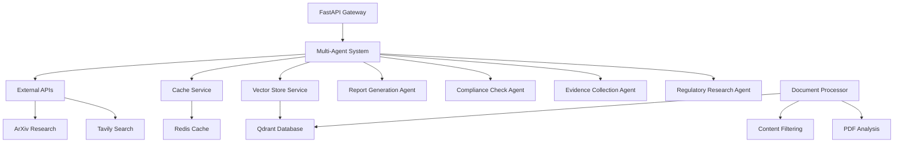

# 🔧 InvestigatorAI API Documentation

[](http://localhost:8000/docs)
[](https://python.org)
[](https://fastapi.tiangolo.com)
[](https://langchain.dev)

> **Advanced Multi-Agent Fraud Investigation System** - Comprehensive API implementation with intelligent agent orchestration, real-time streaming, and professional-grade compliance reporting.

## 📚 Table of Contents

- [🏗️ Architecture Overview](#️-architecture-overview)
- [🤖 Agent System](#-agent-system)
- [🚀 Quick Start](#-quick-start)
- [📡 API Endpoints](#-api-endpoints)
- [🔄 Streaming Investigations](#-streaming-investigations)
- [🛠️ Services Architecture](#️-services-architecture)
- [🔌 Integration Guide](#-integration-guide)
- [🧪 Testing](#-testing)
- [🚀 Deployment](#-deployment)
- [📋 Troubleshooting](#-troubleshooting)

---

## 🏗️ Architecture Overview

InvestigatorAI uses a sophisticated **multi-agent architecture** powered by LangGraph and LangChain, designed for professional fraud investigation workflows.

### Core Components



### Technology Stack

| Component | Technology | Purpose |
|-----------|------------|---------|
| **API Framework** | FastAPI + Uvicorn | High-performance async API |
| **Agent Orchestration** | LangGraph + LangChain | Multi-agent workflow management |
| **LLM Provider** | OpenAI GPT-4o | Advanced reasoning and analysis |
| **Vector Database** | Qdrant | Regulatory document search |
| **Cache Layer** | Redis | Performance optimization |
| **Document Processing** | PyMuPDF + Custom Filters | PDF analysis and content extraction |
| **External Intelligence** | Tavily + ArXiv APIs | Real-time research capabilities |

---

## 🤖 Agent System

### Agent Architecture

Our **four-agent system** provides comprehensive fraud investigation capabilities:

#### 1. 🔍 **Regulatory Research Agent**
```python
# Specialization: AML/BSA compliance and regulatory analysis
Tools: [search_regulatory_documents, search_fraud_research, search_web_intelligence]

Responsibilities:
• Jurisdiction risk assessment (High/Medium/Low classification)
• Regulatory compliance analysis with specific citations
• FATF/OFAC sanctions screening
• Red flag identification from regulatory guidance
```

**Key Features:**
- **12 comprehensive regulatory insights** per search (vs. previous 2)
- **5 Tavily web intelligence results** for current regulatory updates
- **4 ArXiv research papers** for academic fraud detection methods
- **No word limits** - complete analysis coverage

#### 2. 📊 **Evidence Collection Agent**
```python
# Specialization: Quantitative risk assessment and intelligence gathering
Tools: [calculate_transaction_risk, get_exchange_rate_data, search_web_intelligence]

Responsibilities:
• Precise risk score calculation (0.00-1.00 scale)
• Financial intelligence gathering about entities
• Transaction pattern analysis and anomaly detection
• Market context and economic factor assessment
```

**Enhanced Capabilities:**
- **Unlimited comprehensive analysis** (removed 400-word limit)
- **12 detailed evidence points** per investigation
- **6 risk factors** with impact assessment
- **5 web intelligence sources** per query

#### 3. ✅ **Compliance Check Agent**
```python
# Specialization: BSA/AML compliance requirements and filing obligations
Tools: [check_compliance_requirements, search_regulatory_documents]

Responsibilities:
• SAR/CTR filing requirement determination
• Compliance deadline calculation with specific dates
• Risk mitigation strategy recommendations
• Escalation criteria assessment
```

**Professional Standards:**
- **Comprehensive compliance assessment** (no 300-word limit)
- **12 compliance requirements** with detailed explanations
- **6 immediate actions** with deadlines
- **Specific regulatory citations** (e.g., "31 CFR 1020.320")

#### 4. 📝 **Report Generation Agent**
```python
# Specialization: Executive summary and professional report synthesis
Tools: [search_regulatory_documents, check_compliance_requirements]

Responsibilities:
• Coherent narrative synthesis from all agents
• Executive-level conclusions and recommendations
• Management-ready compliance summaries
• Professional regulatory review format
```

**Report Quality:**
- **Complete investigation reports** (removed 600-word limit)
- **8 detailed findings** with supporting evidence
- **Professional tone** suitable for regulatory review
- **Comprehensive coverage** of all investigation aspects

### Agent Orchestration Flow

```python
# LangGraph Workflow
class FraudInvestigationSystem:
    def investigate_fraud_stream():
        """Streaming investigation with real-time progress"""
        
        # Phase 1: Parallel Analysis
        regulatory_task = run_regulatory_research()
        evidence_task = run_evidence_collection()
        compliance_task = run_compliance_check()
        
        # Phase 2: Report Synthesis
        report_task = run_report_generation(
            regulatory_results,
            evidence_results, 
            compliance_results
        )
        
        # Phase 3: Final Decision
        return generate_final_decision(all_results)
```

### Agent Communication Protocol

**Message Types:**
- `HumanMessage`: Investigation requests and instructions
- `AIMessage`: Agent reasoning and tool calls
- `ToolMessage`: Tool execution results and data
- `SystemMessage`: Workflow coordination

**Tool Call Structure:**
```python
{
    "id": "call_regulatory_research_1",
    "name": "search_regulatory_documents", 
    "args": {
        "query": "AML compliance wire transfer $250000",
        "max_results": 5  # Increased limits
    }
}
```

---

## 🚀 Quick Start

### Prerequisites
```bash
# Required environment variables
OPENAI_API_KEY=your_openai_key
TAVILY_SEARCH_API_KEY=your_tavily_key
LANGSMITH_API_KEY=your_langsmith_key (optional)

# Model configuration
LLM_MODEL=gpt-4o
LLM_MAX_TOKENS=15000
EMBEDDING_MODEL=text-embedding-3-large
```

### Local Development
```bash
# 1. Install dependencies
uv sync

# 2. Start services
docker-compose up -d qdrant redis

# 3. Initialize vector database (one-time)
docker-compose up init-docs

# 4. Start API server
cd api && uvicorn main:app --reload --host 0.0.0.0 --port 8000
```

### Docker Deployment
```bash
# Complete system startup
docker-compose up -d

# Verify all services
curl http://localhost:8000/health
```

---

## 📡 API Endpoints

### Core Investigation Endpoints

#### `POST /investigate`
**Standard Investigation** - Complete fraud analysis

```python
# Request
{
    "entity_name": "Global Trading LLC",
    "amount": 75000,
    "destination_country": "UAE", 
    "source_country": "USA",
    "transaction_type": "wire_transfer",
    "entity_type": "business",
    "urgency_level": "high"
}

# Response
{
    "investigation_id": "INV_20250804_061743_a432",
    "status": "completed",
    "final_decision": "pending",
    "agents_completed": 4,
    "total_messages": 27,
    "investigation_report": "**COMPREHENSIVE INVESTIGATION REPORT**...",
    "performance": {
        "total_duration_s": 56.6,
        "workflow_duration_s": 56.6
    }
}
```

#### `POST /investigate/stream`
**Streaming Investigation** - Real-time progress updates

```python
# Server-Sent Events Stream
data: {"message": "🔍 Starting regulatory research analysis..."}
data: {"message": "📊 Calculating transaction risk scores..."}  
data: {"message": "✅ Compliance assessment completed"}
data: {"final_report": "**INVESTIGATION COMPLETE**..."}
```

### Tool Endpoints

#### `GET /search`
**Vector Document Search**
```python
GET /search?query=AML%20compliance&max_results=5

# Response: List[VectorSearchResult]
[
    {
        "content": "Banks must comply with 31 CFR 1020.320...",
        "metadata": {
            "filename": "FFIEC_BSA_Manual.pdf",
            "content_category": "sar_guidance"
        },
        "score": 0.89
    }
]
```

#### `GET /web-search`
**Tavily Web Intelligence**
```python
GET /web-search?query=FATF%20high%20risk%20jurisdictions&max_results=5

# Response: AgentToolResponse
{
    "result": "1. Current FATF High-Risk Jurisdictions...",
    "source": "Tavily",
    "timestamp": "2025-01-04T10:30:00Z"
}
```

#### `GET /arxiv-search`
**Academic Research**
```python
GET /arxiv-search?query=fraud%20detection&max_results=4

# Response: AgentToolResponse  
{
    "result": "1. Advanced ML Techniques for Fraud Detection...",
    "source": "ArXiv",
    "timestamp": "2025-01-04T10:30:00Z"
}
```

### System Endpoints

#### `GET /health`
**System Health Check**
```python
{
    "status": "healthy",
    "vector_store_initialized": true,
    "redis_connected": true,
    "timestamp": "2025-01-04T10:30:00Z",
    "version": "1.0.0"
}
```

---

## 🔄 Streaming Investigations

### Real-Time Progress Tracking

```python
# Client Implementation (JavaScript)
const eventSource = new EventSource('/investigate/stream', {
    method: 'POST',
    body: JSON.stringify(investigationRequest),
    headers: {'Content-Type': 'application/json'}
});

eventSource.onmessage = function(event) {
    const data = JSON.parse(event.data);
    
    if (data.message) {
        console.log("Progress:", data.message);
    }
    
    if (data.final_report) {
        console.log("Investigation Complete:", data.final_report);
        eventSource.close();
    }
};
```

### Streaming Message Types

| Type | Description | Example |
|------|-------------|---------|
| `progress` | Agent execution updates | `"🔍 Starting regulatory research..."` |
| `tool_call` | Tool execution status | `"📡 Searching regulatory documents..."` |
| `agent_complete` | Agent completion | `"✅ Evidence Collection completed"` |
| `final_report` | Investigation results | `"**INVESTIGATION REPORT**..."` |
| `error` | Error conditions | `"❌ External API timeout"` |

---

## 🛠️ Services Architecture

### Vector Store Service (`vector_store.py`)

**Qdrant Integration** with optimized search capabilities:

```python
class VectorStoreManager:
    def initialize_from_documents(documents: List[Document]):
        """Process and index regulatory documents"""
        
    def connect_existing() -> 'VectorStoreManager':
        """Connect to pre-initialized vector store"""
        
    def search(query: str, k: int = 5) -> List[VectorSearchResult]:
        """Hybrid BM25 + Dense vector search"""
```

**Features:**
- **3072-dimensional embeddings** (text-embedding-3-large)
- **Hybrid search** (BM25 sparse + dense vector)
- **2985 filtered document chunks** with procedural text removal
- **Sub-second search** performance

### Cache Service (`cache_service.py`)

**Redis-powered caching** for performance optimization:

```python
class CacheService:
    def get_cached_investigation(cache_key: str):
        """Complete investigation result caching"""
        
    def cache_vector_search(query: str, results: List):
        """Vector search result caching (TTL: 1 hour)"""
        
    def cache_web_intelligence(query: str, results: str):
        """Web search caching (TTL: 30 minutes)"""
```

**Cache Strategy:**
- **Investigation Results**: 24 hours TTL
- **Vector Search**: 1 hour TTL  
- **Web Intelligence**: 30 minutes TTL
- **ArXiv Research**: 6 hours TTL

### Document Processor (`document_processor.py`)

**Advanced PDF processing** with content filtering:

```python
class DocumentProcessor:
    def extract_text_from_pdf(file_path: str) -> str:
        """Extract and filter PDF content"""
        
    def _filter_procedural_text(text: str) -> str:
        """Remove administrative/procedural content"""
        
    def process_documents() -> List[Document]:
        """Process all PDFs with metadata classification"""
```

**Filtering Capabilities:**
- **Procedural text removal** (addresses, form numbers, filing instructions)
- **Content categorization** (sar_guidance, bsa_manual, fatf_recommendations)
- **Chunk optimization** (1000 chars, 200 overlap)
- **Quality validation** (minimum length, completeness checks)

### External APIs Service (`external_apis.py`)

**Third-party integration** with comprehensive error handling:

```python
class ExternalAPIService:
    def search_web(query: str, max_results: int = 7) -> str:
        """Tavily web search with enhanced limits"""
        
    def search_arxiv(query: str, max_results: int = 5) -> str:
        """ArXiv academic research search"""
        
    def get_exchange_rate(from_currency: str, to_currency: str) -> str:
        """Real-time exchange rate data"""
```

---

## 🔌 Integration Guide

### Custom Agent Integration

```python
# Add new specialized agent
class CustomInvestigationAgent:
    def create_custom_agent(self):
        return self._create_agent(
            llm=self.llm,
            tools=CUSTOM_TOOLS,
            system_prompt="""
            You are a specialist in [domain expertise].
            
            ## RESPONSIBILITIES:
            - Custom analysis requirements
            - Specialized tool usage
            - Domain-specific insights
            
            ## OUTPUT FORMAT:
            **CUSTOM ANALYSIS REPORT**
            [Custom report structure]
            """
        )
```

### External Data Source Integration

```python
# Custom tool for external APIs
@tool
def search_custom_database(query: str, max_results: int = 5) -> str:
    """Search custom external database"""
    # Implementation details
    return results

# Register in agent tools
CUSTOM_TOOLS = [search_custom_database, existing_tools...]
```

### Webhook Integration

```python
# Real-time notifications
@app.post("/webhook/investigation-complete")
async def investigation_webhook(payload: InvestigationResult):
    """Handle investigation completion notifications"""
    
    # Custom business logic
    await notify_compliance_team(payload)
    await update_case_management_system(payload)
    
    return {"status": "processed"}
```

---

## 🧪 Testing

### Unit Tests
```bash
# Run all tests
pytest tests/ -v

# Specific test categories
pytest tests/test_api.py::test_investigate_endpoint -v
pytest tests/test_langsmith_integration.py -v
```

### Integration Tests
```bash
# API integration tests
python tests/test_api.py

# LangSmith tracing tests  
python tests/test_langsmith_api_tracing.py

# Container integration
python deploy/scripts/test-containers.py
```

### Performance Testing
```bash
# Load testing (requires containers)
python tests/run_langsmith_tests.py
```

---

## 🚀 Deployment

### Production Environment

```yaml
# docker-compose.prod.yml
version: '3.8'
services:
  api:
    build: ./api
    environment:
      - ENVIRONMENT=production
      - LLM_MAX_TOKENS=15000
      - CACHE_ENABLED=true
    deploy:
      replicas: 3
      resources:
        limits:
          memory: 2G
          cpus: '1.0'
```

### Kubernetes Deployment

```yaml
# k8s/api-deployment.yaml
apiVersion: apps/v1
kind: Deployment
metadata:
  name: investigator-ai-api
spec:
  replicas: 3
  selector:
    matchLabels:
      app: investigator-ai-api
  template:
    spec:
      containers:
      - name: api
        image: investigator-ai:latest
        resources:
          requests:
            memory: "1Gi"
            cpu: "500m"
          limits:
            memory: "2Gi" 
            cpu: "1000m"
```

### Environment Configuration

```bash
# Production environment variables
OPENAI_API_KEY=prod_key_here
TAVILY_SEARCH_API_KEY=prod_key_here
LLM_MODEL=gpt-4o
LLM_MAX_TOKENS=15000
REDIS_HOST=prod-redis.internal
QDRANT_HOST=prod-qdrant.internal
ENVIRONMENT=production
LOG_LEVEL=INFO
```

---

## 📋 Troubleshooting

### Common Issues

#### 1. **Agent Truncation Issues**
**Problem:** Agent responses appear cut off at ~136 characters
```bash
# Solution: Check for word limits in agent prompts
grep -r "max.*words\|word.*limit" api/agents/
```

#### 2. **Vector Store Initialization Fails**
**Problem:** `vector_store_initialized: false`
```bash
# Solution: Rebuild vector database
docker-compose up init-docs --force-recreate
```

#### 3. **Tool Call Limits Not Applied**
**Problem:** Agents use default max_results instead of enhanced limits
```bash
# Solution: Verify agent prompts explicitly specify limits
grep -r "max_results=" api/agents/multi_agent_system.py
```

#### 4. **Memory Issues During Document Processing**
**Problem:** Container OOM during vector database initialization
```bash
# Solution: Increase memory allocation
docker-compose.yml:
  init-docs:
    deploy:
      resources:
        limits:
          memory: 4G
```

### Debug Mode

```bash
# Enable comprehensive logging
export LOG_LEVEL=DEBUG
export ENABLE_PERFORMANCE_LOGGING=true

# Start with debug output
docker-compose up api --no-deps
```

### Performance Monitoring

```bash
# Check service health
curl http://localhost:8000/health

# Monitor investigation performance
curl -X POST http://localhost:8000/investigate \
  -H "Content-Type: application/json" \
  -d '{"entity_name": "Test Corp", "amount": 50000}' \
  | jq '.performance'
```

---

## 📚 Additional Resources

- **[Main Documentation](../README.md)** - Project overview and setup
- **[Agent Prompts](../docs/AGENT_PROMPTS.md)** - Detailed agent prompt engineering
- **[Advanced Retrievers](../docs/ADVANCED_RETRIEVERS.md)** - Vector search optimization
- **[Deployment Guide](../deploy/README.md)** - Production deployment instructions
- **[Frontend Integration](../frontend/README.md)** - UI/UX documentation

---

## 🤝 Contributing

### Code Standards
- **Type hints** required for all functions
- **Docstrings** for public methods
- **Error handling** with proper logging
- **Test coverage** for new features

### Agent Development Guidelines
1. **Comprehensive prompts** with no artificial word limits
2. **Tool usage protocols** with enhanced result limits
3. **Professional output** suitable for regulatory review
4. **Error handling** with graceful degradation

---

*Built with 🔬 by the InvestigatorAI Team | [License](../LICENSE) | [Contributing Guidelines](../README.md#contributing)*