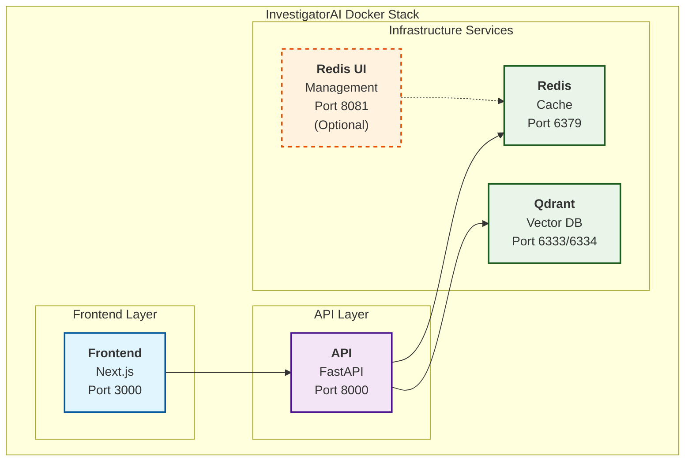

# 🚀 InvestigatorAI Deployment Guide

> **📂 Navigation**: [🏠 Home](../README.md) | [🔧 API Docs](../api/README.md) | [🤖 Agent Architecture](../docs/AGENT_PROMPTS.md) | [📈 Advanced Retrievers](../docs/ADVANCED_RETRIEVERS.md) | [💼 Business Case](../docs/BUSINESS_CASE.md) | [🎓 Certification](../docs/CERTIFICATION_CHALLENGE.md) | [🎬 Demo Guide](../docs/DEMO_GUIDE.md) | [💻 Frontend](../frontend/README.md) | [📊 Data](../data/README.md) | [🚀 Deploy](README.md) | [🧪 Tests](../tests/README.md) | [🔄 Merge](../MERGE.md)

Complete deployment guide for InvestigatorAI fraud investigation system - from infrastructure-only to full application stack.

## 📋 Deployment Options

| Option | Use Case | Services |
|--------|----------|----------|
| **🐳 Full Docker Stack** | Complete local deployment | Frontend + API + Redis + Qdrant |
| **⚙️ Infrastructure Only** | Development with local API | Redis + Qdrant only |
| **☁️ Production** | Scalable cloud deployment | All services + monitoring |

---

## 🚀 Option 1: Full Docker Deployment (Recommended)

Complete containerized deployment with frontend, API, and all infrastructure services.

### 🏗️ Architecture Overview



### Services

| Service | Port | Description |
|---------|------|-------------|
| **Frontend** | 3000 | Next.js React application |
| **API** | 8000 | FastAPI backend with multi-agent system |
| **Redis** | 6379 | Cache and session storage |
| **Qdrant** | 6333/6334 | Vector database for document storage |
| **Redis UI** | 8081 | Optional Redis management interface |

### Prerequisites

- **Docker** (v20.10+) and **Docker Compose** (v2.0+)
- **8GB RAM** minimum (12GB recommended)
- **API Keys** for external services

### Quick Start

#### 1. Clone and Setup

```bash
# Clone the repository
git clone <repository-url>
cd InvestigatorAI

# Copy environment template
cp docker.env.example .env

# Edit with your API keys
nano .env  # or use your preferred editor
```

#### 2. Configure API Keys

Edit `.env` and add your API keys:

```bash
# Required
OPENAI_API_KEY=your_openai_api_key_here
TAVILY_SEARCH_API_KEY=your_tavily_api_key_here

# Optional
EXCHANGE_RATE_API_KEY=your_exchange_rate_api_key_here
LANGSMITH_API_KEY=your_langsmith_api_key_here
```

#### 3. Deploy

```bash
# Run the automated deployment script
./deploy/scripts/start-docker-deployment.sh
```

The script will:
- ✅ Build all Docker images
- ✅ Start infrastructure services (Redis, Qdrant)
- ✅ Wait for services to be healthy
- ✅ Start the API backend
- ✅ Start the frontend
- ✅ Verify all services are running

#### 4. Access the Application

Once deployment is complete:

- **Frontend**: http://localhost:3000
- **API**: http://localhost:8000
- **API Documentation**: http://localhost:8000/docs
- **Health Check**: http://localhost:8000/health

### Manual Deployment Control

If you prefer manual control:

```bash
# Build all services
docker-compose build

# Start infrastructure only
docker-compose up -d redis qdrant

# Start all core services
docker-compose up -d api frontend

# Start with UI tools
docker-compose --profile ui up -d
```

---

## ⚙️ Option 2: Infrastructure Only Deployment

For development where you run API and frontend locally but want containerized infrastructure.

### Quick Start

```bash
# Start only Redis and Qdrant
docker-compose up -d redis qdrant

# Test integration
docker-compose ps
curl http://localhost:6333/collections  # Test Qdrant
curl http://localhost:6379/ping         # Test Redis

# Start your local API (in another terminal)
cd api && uvicorn main:app --reload --host 0.0.0.0 --port 8000

# Start frontend (in another terminal)
cd frontend && npm run dev

# Check cache status
curl http://localhost:8000/cache/stats
```

### Infrastructure Services

#### Redis Cache
- **Purpose**: High-performance caching for API responses and investigation data
- **Port**: 6379
- **Memory**: 256MB limit with LRU eviction
- **Persistence**: Append-only file for data durability

#### Qdrant Vector Database
- **Purpose**: Persistent vector storage for regulatory documents
- **HTTP Port**: 6333
- **gRPC Port**: 6334
- **Storage**: Persistent volume for document embeddings

#### Optional: Redis Commander (UI)
```bash
# Start Redis management UI
docker-compose --profile ui up -d redis-commander
# Visit: http://localhost:8081
```

---

## 🔧 Configuration

### Environment Variables

#### Full Docker Deployment
```bash
# API Keys (required)
OPENAI_API_KEY=your_openai_api_key_here
TAVILY_SEARCH_API_KEY=your_tavily_api_key_here
EXCHANGE_RATE_API_KEY=your_exchange_rate_api_key_here
LANGSMITH_API_KEY=your_langsmith_api_key_here

# LangSmith monitoring
LANGSMITH_TRACING=true
LANGSMITH_PROJECT=InvestigatorAI-Docker

# Performance settings (auto-configured)
DEFAULT_RETRIEVAL_METHOD=auto
BM25_ENABLED=true
ENABLE_PERFORMANCE_LOGGING=true
```

#### Infrastructure Only
```bash
# Copy config.env.template to .env and configure:
REDIS_HOST=localhost
REDIS_PORT=6379
REDIS_DB=0
CACHE_ENABLED=true

QDRANT_HOST=localhost
QDRANT_PORT=6333
QDRANT_GRPC_PORT=6334
VECTOR_COLLECTION_NAME=regulatory_documents
```

### Volume Mounts

| Path | Description |
|------|-------------|
| `./data:/app/data:ro` | Read-only access to PDF documents |
| `redis_data:/data` | Persistent Redis data |
| `qdrant_storage:/qdrant/storage` | Persistent vector database |

---

## 🎯 Caching Strategy

### Cache Hierarchies

1. **Investigation Cache** (30 min TTL)
   - Risk analysis results
   - Complete investigation data

2. **External API Cache** (1-2 hour TTL)
   - Tavily web search results
   - ArXiv research papers
   - Exchange rate data

3. **Document Search Cache** (30 min TTL)
   - Vector similarity search results
   - Regulatory document chunks

### Cache Performance Benefits

- **Risk Analysis**: 80% faster on repeated transactions
- **External APIs**: 95% faster on cached queries
- **Vector Search**: 70% faster on similar document queries

---

## 🛠️ Management & Operations

### Container Operations

```bash
# Start services
docker-compose up -d redis qdrant
docker-compose up -d api frontend  # Full stack

# Stop services  
docker-compose down

# View logs
docker-compose logs -f
docker-compose logs -f api
docker-compose logs -f frontend

# Restart specific service
docker-compose restart redis
```

### Cache Management

```bash
# View cache statistics
curl http://localhost:8000/cache/stats

# Clear all cache
curl -X DELETE http://localhost:8000/cache/clear

# Clear investigation cache only
curl -X DELETE http://localhost:8000/cache/clear/investigations

# Clear external API cache only
curl -X DELETE http://localhost:8000/cache/clear/external
```

### API Testing

```bash
# Health check with all service status
curl http://localhost:8000/health

# Start investigation
curl -X POST http://localhost:8000/investigate \
  -H "Content-Type: application/json" \
  -d '{
    "amount": 75000,
    "currency": "USD", 
    "description": "International wire transfer",
    "customer_name": "John Doe",
    "risk_rating": "High",
    "country_to": "Romania"
  }'

# Vector search regulatory documents
curl "http://localhost:8000/search?query=AML%20compliance&max_results=5"

# Get exchange rates
curl "http://localhost:8000/exchange-rate?from_currency=USD&to_currency=EUR"

# Web intelligence search
curl "http://localhost:8000/web-search?query=Romania%20financial%20regulations&max_results=3"

# Academic research search
curl "http://localhost:8000/arxiv-search?query=fraud%20detection%20methods&max_results=3"
```

---

## 🔍 Monitoring & Debugging

### Health Checks

```bash
# All services
docker-compose ps

# Individual service health
curl http://localhost:8000/health          # API health
curl http://localhost:3000                 # Frontend
curl http://localhost:6333/health          # Qdrant
docker-compose exec redis redis-cli ping   # Redis
```

### View Logs

```bash
# All services
docker-compose logs -f

# Specific service
docker-compose logs -f api
docker-compose logs -f frontend

# Last 100 lines
docker-compose logs --tail=100 api
```

### Resource Monitoring

```bash
# View all services status
docker-compose ps

# Resource usage
docker stats

# Service inspection
docker-compose exec api ps aux
```

### Common Issues

#### API Not Starting
```bash
# Check logs
docker-compose logs api

# Common causes:
# - Missing API keys
# - Redis/Qdrant not ready
# - Port conflicts
```

#### Frontend Connection Issues
```bash
# Check API connectivity
docker-compose exec frontend curl http://api:8000/health

# Verify environment variables
docker-compose exec frontend env | grep NEXT_PUBLIC
```

#### Cache Unavailable
```bash
# Check Redis container
docker-compose ps redis
docker-compose logs redis

# Restart if needed
docker-compose restart redis
```

#### Vector Store Not Initialized
```bash
# Check Qdrant container
docker-compose ps qdrant
docker-compose logs qdrant

# Check collection exists
curl http://localhost:6333/collections/regulatory_documents
```

---

## 🛡️ Security & Production

### Production Configuration

```yaml
# docker-compose.override.yml for production
services:
  redis:
    command: redis-server --requirepass your_redis_password
  
  qdrant:
    environment:
      QDRANT__SERVICE__API_KEY: your_qdrant_api_key
  
  api:
    deploy:
      resources:
        limits:
          memory: 2G
          cpus: "1.0"
        reservations:
          memory: 1G
          cpus: "0.5"
```

### Security Considerations

- Store API keys in `.env` file (not in docker-compose.yml)
- Use Docker secrets for production
- Enable TLS/SSL with reverse proxy
- Restrict network access to container ports
- Regularly update container images

---

## 📊 Performance Optimization

### Resource Allocation

```yaml
# Recommended Docker resource limits
api:
  deploy:
    resources:
      limits:
        memory: 2G
        cpus: "1.0"

frontend:
  deploy:
    resources:
      limits:
        memory: 512M
        cpus: "0.5"

redis:
  deploy:
    resources:
      limits:
        memory: 512M
        cpus: "0.5"

qdrant:
  deploy:
    resources:
      limits:
        memory: 2G
        cpus: "1.0"
```

### Performance Metrics

#### Expected Improvements
- **Investigation Speed**: 2-3x faster on cached data
- **API Response Time**: 50-80% reduction for repeated queries
- **External API Usage**: 60-90% reduction in actual API calls
- **Vector Search**: 70% faster for similar document queries

#### Monitoring Endpoints
- Cache Statistics: `GET /cache/stats`
- Health Status: `GET /health`
- Vector Store Status: `GET /search?query=test&max_results=1`

---

## 🧹 Maintenance & Backup

### Regular Maintenance

#### Daily
```bash
# Check service health
./deploy/scripts/check-health.sh  # If available

# View error logs
docker-compose logs --since 24h | grep ERROR
```

#### Weekly
```bash
# Update containers
docker-compose pull
docker-compose up -d

# Clean unused images
docker image prune -f
```

#### Monthly
```bash
# Full system cleanup
docker system prune -a
docker volume prune

# Backup data
docker run --rm -v qdrant_storage:/data -v $(pwd):/backup alpine tar czf /backup/qdrant-backup.tar.gz /data
```

### Backup and Restore

#### Backup
```bash
# Create backup directory
mkdir -p backups/$(date +%Y%m%d)

# Backup Qdrant data
docker run --rm -v qdrant_storage:/data -v $(pwd)/backups/$(date +%Y%m%d):/backup alpine tar czf /backup/qdrant.tar.gz /data

# Backup Redis data
docker run --rm -v redis_data:/data -v $(pwd)/backups/$(date +%Y%m%d):/backup alpine tar czf /backup/redis.tar.gz /data
```

#### Restore
```bash
# Stop services
docker-compose down

# Restore Qdrant
docker run --rm -v qdrant_storage:/data -v $(pwd)/backups/20240101:/backup alpine tar xzf /backup/qdrant.tar.gz -C /

# Restore Redis
docker run --rm -v redis_data:/data -v $(pwd)/backups/20240101:/backup alpine tar xzf /backup/redis.tar.gz -C /

# Restart services
docker-compose up -d
```

---

## 🔄 Stopping and Cleanup

### Graceful Shutdown

```bash
# Use the automated stop script
./deploy/scripts/stop-docker-deployment.sh

# Or manually
docker-compose down
```

### Complete Cleanup

```bash
# Remove everything including data
docker-compose down -v --rmi all
docker system prune -a
```

---

## 🚀 Deployment Scripts

The deployment includes automated scripts for easy management:

### Available Scripts

| Script | Purpose |
|--------|---------|
| `start-docker-deployment.sh` | Complete automated deployment |
| `stop-docker-deployment.sh` | Graceful shutdown with cleanup options |
| `start-containers.sh` | Infrastructure-only deployment |
| `test-containers.py` | Container health testing |

### Using Scripts

```bash
# Make scripts executable (if needed)
chmod +x deploy/scripts/*.sh

# Full deployment
./deploy/scripts/start-docker-deployment.sh

# Stop with cleanup options
./deploy/scripts/stop-docker-deployment.sh

# Infrastructure only
./deploy/scripts/start-containers.sh
```

---

## 📞 Support & Troubleshooting

### Getting Help

1. **Check the logs**: `docker-compose logs service-name`
2. **Verify health checks**: `curl http://localhost:8000/health`
3. **Review configurations**: `docker-compose config`
4. **Test connectivity**: `docker-compose exec api ping qdrant`

### Common Solutions

- Verify all required API keys are set in `.env`
- Ensure sufficient system resources (8GB+ RAM)
- Check port conflicts with existing services
- Review the main project README for additional troubleshooting

---

## 🎉 Ready to Use!

Your InvestigatorAI is now deployed with:

- ✅ **Complete Docker Stack**: Frontend + API + Infrastructure
- ✅ **High-Performance Caching**: Redis with intelligent strategies
- ✅ **Persistent Vector Storage**: Qdrant for document embeddings
- ✅ **Production-Ready Setup**: Health checks and monitoring
- ✅ **Automated Scripts**: Easy deployment and management
- ✅ **Comprehensive Monitoring**: LangSmith integration ready
- ✅ **BM25 Optimization**: Lightning-fast document retrieval

**Choose your deployment option and start investigating fraud with AI! ⚡**

For detailed component documentation, see:
- [Frontend README](../frontend/README.md)
- [API Documentation](http://localhost:8000/docs) (when running)
- [Test Suite](../tests/README.md)
- [Project Overview](../README.md)