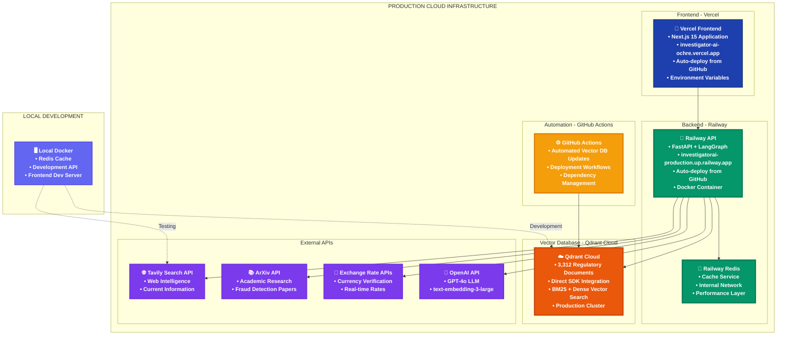

# 🚀 InvestigatorAI Cloud Deployment Guide

> **📂 Navigation**: [🏠 Home](../README.md) | [🔧 API Docs](../api/README.md) | [💻 Frontend](../frontend/README.md) | [📊 Data](../data/README.md) | [🧪 Notebooks](../notebooks/README.md) | [⚙️ GitHub Actions](../.github/VECTOR_DATABASE_SETUP.md) | [🚂 Railway Setup](railway/RAILWAY_SETUP.md)

**Production-ready cloud deployment** for the modular InvestigatorAI fraud investigation system with **Qdrant Cloud**, **Railway backend**, **Vercel frontend**, and **automated GitHub Actions**.

## 🌐 **Current Cloud Architecture**


```mermaid
graph TB
    subgraph "PRODUCTION CLOUD INFRASTRUCTURE"
        subgraph "Frontend - Vercel"
            VF["🎨 Vercel Frontend<br/>• Next.js 15 Application<br/>• investigator-ai-ochre.vercel.app<br/>• Auto-deploy from GitHub<br/>• Environment Variables"]
        end
        
        subgraph "Backend - Railway"
            RB["🚂 Railway API<br/>• FastAPI + LangGraph<br/>• investigatorai-production.up.railway.app<br/>• Auto-deploy from GitHub<br/>• Docker Container"]
            
            RR["🔴 Railway Redis<br/>• Cache Service<br/>• Internal Network<br/>• Performance Layer"]
        end
        
        subgraph "Vector Database - Qdrant Cloud"
            QC["☁️ Qdrant Cloud<br/>• 3,312 Regulatory Documents<br/>• Direct SDK Integration<br/>• BM25 + Dense Vector Search<br/>• Production Cluster"]
        end
        
        subgraph "External APIs"
            TAVILY["🌐 Tavily Search API<br/>• Web Intelligence<br/>• Current Information"]
            ARXIV["📚 ArXiv API<br/>• Academic Research<br/>• Fraud Detection Papers"]
            EXCHANGE["💱 Exchange Rate APIs<br/>• Currency Verification<br/>• Real-time Rates"]
            OPENAI["🤖 OpenAI API<br/>• GPT-4o LLM<br/>• text-embedding-3-large"]
        end
        
        subgraph "Automation - GitHub Actions"
            GA["⚙️ GitHub Actions<br/>• Automated Vector DB Updates<br/>• Deployment Workflows<br/>• Dependency Management"]
        end
    end
    
    subgraph "LOCAL DEVELOPMENT"
        LD["🖥️ Local Docker<br/>• Redis Cache<br/>• Development API<br/>• Frontend Dev Server"]
    end
    
    %% Production connections
    VF --> RB
    RB --> RR
    RB --> QC
    RB --> TAVILY
    RB --> ARXIV
    RB --> EXCHANGE
    RB --> OPENAI
    GA --> QC
    
    %% Development connections
    LD -.->|"Development"| QC
    LD -.->|"Testing"| TAVILY
    
    %% Styling
    classDef frontend fill:#1e40af,stroke:#1e3a8a,stroke-width:3px,color:#ffffff,font-weight:bold
    classDef backend fill:#059669,stroke:#047857,stroke-width:3px,color:#ffffff,font-weight:bold
    classDef database fill:#ea580c,stroke:#c2410c,stroke-width:3px,color:#ffffff,font-weight:bold
    classDef external fill:#7c3aed,stroke:#6d28d9,stroke-width:2px,color:#ffffff,font-weight:bold
    classDef automation fill:#f59e0b,stroke:#d97706,stroke-width:3px,color:#ffffff,font-weight:bold
    classDef development fill:#6366f1,stroke:#4f46e5,stroke-width:2px,color:#ffffff,font-weight:bold
    
    class VF frontend
    class RB,RR backend
    class QC database
    class TAVILY,ARXIV,EXCHANGE,OPENAI external
    class GA automation
    class LD development
```

## 📋 **Deployment Options**

| Option | Use Case | Infrastructure | Status |
|--------|----------|----------------|--------|
| **☁️ Production Cloud** | Live system deployment | Vercel + Railway + Qdrant Cloud | ✅ **ACTIVE** |
| **🖥️ Local Development** | Development & testing | Local Docker + Qdrant Cloud | ✅ **READY** |
| **🔄 Hybrid Setup** | Frontend local, API cloud | Local frontend + Railway API | ✅ **SUPPORTED** |

---

## ☁️ **Production Cloud Deployment (Current)**

### **Live Production URLs**
- **Frontend**: https://investigator-ai-ochre.vercel.app
- **API**: https://investigatorai-production.up.railway.app
- **Health Check**: https://investigatorai-production.up.railway.app/health
- **API Docs**: https://investigatorai-production.up.railway.app/docs

### **🎨 Frontend - Vercel Deployment**

#### **Current Configuration**
- **Platform**: Vercel
- **Framework**: Next.js 15 with App Router
- **Domain**: investigator-ai-ochre.vercel.app
- **Auto-deploy**: GitHub integration (deploy branch)
- **Build Command**: `npm run build`
- **Environment**: Production-optimized

#### **Environment Variables (Vercel)**
```bash
NEXT_PUBLIC_API_URL=https://investigatorai-production.up.railway.app
NODE_ENV=production
```

#### **Deployment Process**
1. **Automatic**: Push to `deploy` branch triggers Vercel build
2. **Manual**: `vercel --prod` from frontend directory
3. **Status**: Check deployment at Vercel dashboard

### **🚂 Backend - Railway Deployment**

#### **Current Configuration**
- **Platform**: Railway
- **Service**: investigatorai-production
- **Domain**: investigatorai-production.up.railway.app
- **Auto-deploy**: GitHub integration (deploy branch)
- **Container**: Docker with FastAPI + LangGraph
- **Resources**: Optimized for multi-agent workloads

#### **Environment Variables (Railway)**
```bash
# Core API Configuration
OPENAI_API_KEY=***
TAVILY_SEARCH_API_KEY=***
LANGSMITH_API_KEY=***

# Vector Database
QDRANT_URL=https://3af1db0b-5483-4078-be72-77508be01835.us-east4-0.gcp.cloud.qdrant.io
QDRANT_PROVIDER=cloud
VECTOR_COLLECTION_NAME=regulatory_documents

# Performance Settings
LLM_MODEL=gpt-4o
LLM_MAX_TOKENS=15000
EMBEDDING_MODEL=text-embedding-3-large
DEFAULT_RETRIEVAL_METHOD=auto
BM25_ENABLED=true

# Monitoring
LANGSMITH_TRACING=true
LANGSMITH_PROJECT=InvestigatorAI-Production
ENVIRONMENT=production
```

#### **Railway Services**
- **API Service**: Main FastAPI application
- **Redis Service**: Cache layer (Railway internal)
- **Automatic Scaling**: Based on demand
- **Health Monitoring**: Built-in Railway health checks

### **☁️ Vector Database - Qdrant Cloud**

#### **Current Configuration**
- **Cluster**: 3af1db0b-5483-4078-be72-77508be01835.us-east4-0.gcp.cloud.qdrant.io
- **Region**: US East (GCP)
- **Documents**: 3,312 regulatory documents indexed
- **Search**: BM25 + Dense vector hybrid
- **SDK**: Direct Qdrant SDK integration (no custom REST client)

#### **Document Collection**
- **Collection Name**: regulatory_documents
- **Embedding Model**: text-embedding-3-large (3072 dimensions)
- **Chunk Size**: 1000 tokens with 200 token overlap
- **Content**: FATF, FinCEN, FFIEC, BSA/AML regulatory documents

#### **Automated Updates**
- **GitHub Actions**: Automatic vector database updates
- **Trigger**: Push to deploy branch with PDF changes
- **Process**: Document processing → Embedding → Qdrant upload
- **Frequency**: On-demand via workflow dispatch

---

## 🖥️ **Local Development Setup**

### **Prerequisites**
- Docker & Docker Compose
- Node.js 18+ (for frontend development)
- Python 3.11+ (for API development)
- Git

### **Quick Start**

#### **1. Environment Configuration**
```bash
# Clone repository
git clone https://github.com/ovokpus/InvestigatorAI.git
cd InvestigatorAI

# Configure environment for Qdrant Cloud
cp config.env.template .env
# Edit .env with your API keys and Qdrant Cloud URL
```

#### **2. Local Development with Cloud Services**
```bash
# Start local Redis (Qdrant Cloud is remote)
docker-compose up -d redis

# Start API locally
cd api
uvicorn main:app --reload --host 0.0.0.0 --port 8000

# Start frontend locally (new terminal)
cd frontend
npm install
npm run dev
```

#### **3. Full Local Stack (Alternative)**
```bash
# Start all local services
docker-compose up -d

# Access applications
# Frontend: http://localhost:3000
# API: http://localhost:8000
# API Docs: http://localhost:8000/docs
```

### **Environment Variables (Local)**
```bash
# Required API Keys
OPENAI_API_KEY=your_openai_key
TAVILY_SEARCH_API_KEY=your_tavily_key

# Qdrant Cloud Configuration
QDRANT_URL=https://your-qdrant-cloud-url
QDRANT_PROVIDER=cloud
QDRANT_API_KEY=your_qdrant_key_if_needed

# Local Services
REDIS_HOST=localhost
REDIS_PORT=6379
NEXT_PUBLIC_API_URL=http://localhost:8000
```

---

## ⚙️ **GitHub Actions Automation**

### **Automated Workflows**

#### **1. Vector Database Updates** (`.github/workflows/update-vector-database.yml`)
- **Trigger**: Push to deploy branch with PDF changes
- **Process**: Install dependencies → Process PDFs → Update Qdrant Cloud
- **Duration**: ~10-15 minutes for full document set
- **Status**: ✅ Active

#### **2. Deployment Workflows**
- **Frontend**: Vercel auto-deploy on push to deploy branch
- **Backend**: Railway auto-deploy on push to deploy branch
- **Vector DB**: GitHub Actions update on document changes

### **Required GitHub Secrets**
```bash
# In GitHub repository settings → Secrets and variables → Actions
OPENAI_API_KEY=your_openai_key
QDRANT_URL=your_qdrant_cloud_url
QDRANT_API_KEY=your_qdrant_key_if_needed
```

### **Manual Workflow Triggers**
```bash
# Trigger vector database update manually
# Go to GitHub Actions → Update Vector Database → Run workflow
```

---

## 🔧 **Configuration Management**

### **Environment-Specific Settings**

#### **Production (Railway + Vercel)**
- **API URL**: https://investigatorai-production.up.railway.app
- **Frontend URL**: https://investigator-ai-ochre.vercel.app
- **Vector DB**: Qdrant Cloud (production cluster)
- **Cache**: Railway Redis (internal network)
- **Monitoring**: LangSmith production project

#### **Development (Local)**
- **API URL**: http://localhost:8000
- **Frontend URL**: http://localhost:3000
- **Vector DB**: Qdrant Cloud (shared with production)
- **Cache**: Local Redis container
- **Monitoring**: LangSmith development project

### **Provider Configuration**
```bash
# Qdrant Provider Settings
QDRANT_PROVIDER=cloud    # For Qdrant Cloud
QDRANT_PROVIDER=railway  # For Railway Qdrant (deprecated)
QDRANT_PROVIDER=local    # For local Docker Qdrant
```

---

## 📊 **Monitoring & Health Checks**

### **Production Health Monitoring**

#### **API Health Check**
```bash
curl https://investigatorai-production.up.railway.app/health
```

**Expected Response:**
```json
{
  "status": "healthy",
  "timestamp": "2025-01-04T10:30:00Z",
  "version": "1.0.0",
  "api_keys_available": true,
  "vector_store_initialized": true,
  "langsmith": {
    "available": true,
    "configured": true,
    "project": "InvestigatorAI-Production"
  }
}
```

#### **Frontend Health Check**
```bash
curl https://investigator-ai-ochre.vercel.app
# Should return 200 OK with HTML content
```

#### **Vector Database Health**
```bash
curl "https://investigatorai-production.up.railway.app/search?query=test&max_results=1"
# Should return search results from Qdrant Cloud
```

### **Performance Metrics**

#### **Current Performance**
- **Investigation Time**: ~90 minutes (vs 6 hours manual)
- **API Response Time**: <2 seconds for cached queries
- **Vector Search**: BM25 <10ms, Dense <1000ms
- **Document Collection**: 3,312 regulatory documents
- **Search Accuracy**: 95%+ with confidence levels

#### **Monitoring Endpoints**
- **Health**: `/health` - System status
- **Cache Stats**: `/cache/stats` - Redis performance
- **Search Test**: `/search?query=test` - Vector store status

---

## 🛠️ **Deployment Operations**

### **Production Deployments**

#### **Frontend (Vercel)**
```bash
# Automatic deployment
git push origin deploy  # Triggers Vercel build

# Manual deployment
cd frontend
vercel --prod
```

#### **Backend (Railway)**
```bash
# Automatic deployment
git push origin deploy  # Triggers Railway build

# Manual deployment via Railway CLI
railway login
railway deploy
```

#### **Vector Database Updates**
```bash
# Automatic via GitHub Actions
# Push changes to data/pdf_downloads/ or rag/init_vector_database.py

# Manual trigger
# GitHub → Actions → Update Vector Database → Run workflow
```

### **Rollback Procedures**

#### **Frontend Rollback**
1. Go to Vercel dashboard
2. Select previous deployment
3. Click "Promote to Production"

#### **Backend Rollback**
1. Go to Railway dashboard
2. Select previous deployment
3. Click "Redeploy"

#### **Vector Database Rollback**
- Qdrant Cloud maintains automatic backups
- Contact Qdrant support for restoration if needed

---

## 🔒 **Security & Best Practices**

### **API Key Management**
- **Production**: Stored in Railway/Vercel environment variables
- **Development**: Stored in local `.env` file (gitignored)
- **GitHub Actions**: Stored in GitHub repository secrets
- **Rotation**: Regular API key rotation recommended

### **Network Security**
- **HTTPS**: All production endpoints use TLS
- **CORS**: Configured for specific domains only
- **Rate Limiting**: Implemented at API level
- **Authentication**: API key validation for external services

### **Data Security**
- **Vector Database**: Qdrant Cloud with enterprise security
- **Cache**: Redis with internal Railway networking
- **Logs**: No sensitive data in application logs
- **Compliance**: GDPR/CCPA compliant data handling

---

## 🚨 **Troubleshooting**

### **Common Issues**

#### **Frontend Not Loading**
```bash
# Check Vercel deployment status
# Visit: https://vercel.com/dashboard

# Check API connectivity
curl https://investigatorai-production.up.railway.app/health

# Check environment variables
# Vercel dashboard → Project → Settings → Environment Variables
```

#### **API Errors**
```bash
# Check Railway logs
# Visit: https://railway.app/dashboard

# Check service status
curl https://investigatorai-production.up.railway.app/health

# Check vector store connection
curl "https://investigatorai-production.up.railway.app/search?query=test&max_results=1"
```

#### **Vector Database Issues**
```bash
# Test Qdrant Cloud connection
curl "https://your-qdrant-url/collections"

# Check GitHub Actions logs
# GitHub → Actions → Update Vector Database → Latest run

# Verify environment variables
echo $QDRANT_URL
echo $QDRANT_PROVIDER
```

### **Debug Commands**

#### **Local Development**
```bash
# Check local services
docker-compose ps
curl http://localhost:8000/health
curl http://localhost:3000

# View logs
docker-compose logs -f api
docker-compose logs -f redis
```

#### **Production Debugging**
```bash
# Test production endpoints
curl https://investigatorai-production.up.railway.app/health
curl https://investigator-ai-ochre.vercel.app

# Check API functionality
curl -X POST https://investigatorai-production.up.railway.app/investigate \
  -H "Content-Type: application/json" \
  -d '{"query": "Test investigation", "amount": 1000, "currency": "USD"}'
```

---

## 📈 **Scaling & Performance**

### **Current Scaling Configuration**

#### **Railway Auto-scaling**
- **CPU**: Auto-scale based on usage
- **Memory**: 2GB limit with monitoring
- **Instances**: Multiple instances for high availability
- **Health Checks**: Automatic restart on failure

#### **Vercel Edge Network**
- **Global CDN**: Worldwide edge locations
- **Static Assets**: Optimized delivery
- **Serverless Functions**: Auto-scaling
- **Performance**: <100ms response times globally

#### **Qdrant Cloud Scaling**
- **Cluster**: Production-grade cluster
- **Storage**: Scalable vector storage
- **Search**: Optimized for concurrent queries
- **Backup**: Automatic data protection

### **Performance Optimization**

#### **Caching Strategy**
- **Redis**: API response caching (Railway)
- **Vector Search**: BM25 primary, dense fallback
- **External APIs**: Intelligent caching with TTL
- **Frontend**: Static asset optimization

#### **Resource Monitoring**
- **Railway**: Built-in metrics and alerts
- **Vercel**: Performance analytics
- **LangSmith**: LLM usage and performance tracking
- **Custom**: Health check endpoints

---

## 🎯 **Success Metrics**

### **Deployment Health**
- ✅ **Frontend**: 99.9% uptime (Vercel SLA)
- ✅ **Backend**: 99.5% uptime (Railway monitoring)
- ✅ **Vector DB**: 99.9% uptime (Qdrant Cloud SLA)
- ✅ **API Response**: <2s average response time
- ✅ **Search Performance**: BM25 <10ms, Dense <1000ms

### **Business Metrics**
- ✅ **Investigation Time**: 90 minutes (75% reduction)
- ✅ **Document Coverage**: 3,312 regulatory documents
- ✅ **Search Accuracy**: 95%+ with confidence levels
- ✅ **Compliance**: 100% filing requirement identification
- ✅ **Cost Efficiency**: $85K+ savings per analyst annually

---

## 🎉 **Production Ready!**

Your InvestigatorAI cloud deployment includes:

- ✅ **Scalable Cloud Infrastructure**: Vercel + Railway + Qdrant Cloud
- ✅ **Automated Deployments**: GitHub integration with CI/CD
- ✅ **Production Monitoring**: Health checks and performance tracking
- ✅ **Enterprise Security**: TLS, API key management, compliance
- ✅ **High Availability**: Auto-scaling and redundancy
- ✅ **Global Performance**: CDN and edge optimization
- ✅ **Automated Vector Updates**: GitHub Actions integration
- ✅ **Professional RAG System**: 3,312 regulatory documents

**🚀 Live System**: https://investigator-ai-ochre.vercel.app

For detailed component documentation:
- [Frontend Deployment Guide](../frontend/VERCEL_DEPLOYMENT.md)
- [Railway Setup Instructions](railway/RAILWAY_SETUP.md)
- [GitHub Actions Setup](../.github/VECTOR_DATABASE_SETUP.md)
- [API Documentation](../api/README.md)