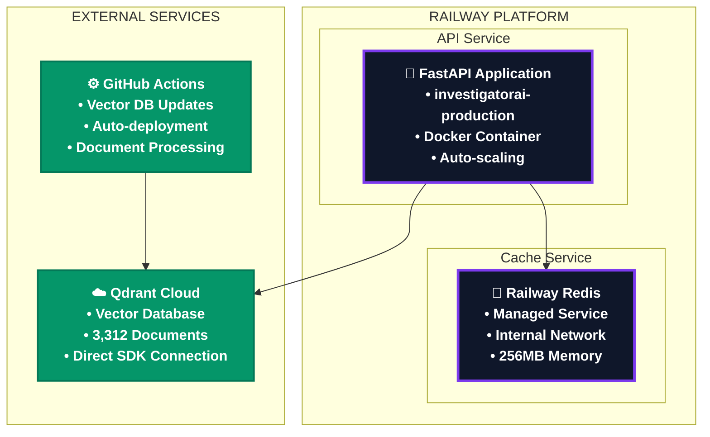

# 🚂 Railway Deployment for InvestigatorAI

> **📂 Navigation**: [🏠 Home](../../README.md) | [🔧 API Docs](../../api/README.md) | [🚀 Deploy Guide](../README.md) | [💻 Frontend](../../frontend/README.md)

**Production Railway deployment** for InvestigatorAI API with **Redis cache** and **Qdrant Cloud** vector database integration.

## 🌐 **Current Production Setup**

- **Live API**: https://investigatorai-production.up.railway.app
- **Services**: API + Redis (Railway) + Qdrant Cloud (external)
- **Auto-deploy**: GitHub integration on `deploy` branch
- **Vector Database**: Qdrant Cloud (no longer Railway-hosted)

## 🏗️ **Architecture Overview**



## 🚀 **Quick Deployment**

### **Prerequisites**
- Railway CLI installed
- GitHub repository connected
- API keys configured

### **1. Create Railway Project**
```bash
railway login
railway new investigatorai-production
```

### **2. Add Services**

#### **API Service (Automatic)**
- **Source**: GitHub repository (auto-created)
- **Build**: Docker from `api/Dockerfile`
- **Domain**: Auto-generated Railway domain

#### **Redis Service**
```bash
railway add redis
```

### **3. Configure Environment Variables**

#### **API Service Environment**
```bash
# Core API Keys
OPENAI_API_KEY=your_openai_key
TAVILY_SEARCH_API_KEY=your_tavily_key
LANGSMITH_API_KEY=your_langsmith_key

# Qdrant Cloud Configuration
QDRANT_URL=https://your-qdrant-cloud-url
QDRANT_PROVIDER=cloud
QDRANT_API_KEY=your_qdrant_key_if_needed
VECTOR_COLLECTION_NAME=regulatory_documents

# Performance Settings
LLM_MODEL=gpt-4o
LLM_MAX_TOKENS=15000
EMBEDDING_MODEL=text-embedding-3-large
DEFAULT_RETRIEVAL_METHOD=auto
BM25_ENABLED=true

# Monitoring
LANGSMITH_TRACING=true
LANGSMITH_PROJECT=InvestigatorAI-Production
ENVIRONMENT=production
```

#### **Redis Connection (Auto-configured)**
Railway automatically provides:
- `REDIS_URL` - Full connection string
- Internal networking between services

### **4. Deploy**
```bash
# Manual deployment
railway up

# Or push to deploy branch for auto-deployment
git push origin deploy
```

## 🔧 **Service Configuration**

### **API Service Details**
- **Platform**: Railway
- **Runtime**: Docker container
- **Port**: 8000 (auto-detected)
- **Health Check**: `/health` endpoint
- **Scaling**: Automatic based on demand
- **Logs**: Available via Railway dashboard

### **Redis Configuration**
- **Type**: Railway managed Redis
- **Memory**: 256MB with LRU eviction
- **Persistence**: Append-only file
- **Network**: Internal Railway networking
- **Connection**: Auto-configured via `REDIS_URL`

### **Qdrant Cloud Integration**
- **Provider**: Qdrant Cloud (external)
- **Connection**: Direct SDK via `QDRANT_URL`
- **Documents**: 3,312 regulatory documents
- **Updates**: Via GitHub Actions automation
- **No Railway Qdrant service needed**

## 📊 **Monitoring & Management**

### **Health Checks**
```bash
# API health
curl https://investigatorai-production.up.railway.app/health

# Expected response
{
  "status": "healthy",
  "vector_store_initialized": true,
  "api_keys_available": true,
  "langsmith": {"available": true, "configured": true}
}
```

### **Railway CLI Commands**
```bash
# Check deployment status
railway status

# View API logs
railway logs --follow

# Get domain URL
railway domain

# Connect to Redis
railway connect redis
```

### **Performance Testing**
```bash
# Test investigation endpoint
curl -X POST https://investigatorai-production.up.railway.app/investigate \
  -H "Content-Type: application/json" \
  -d '{
    "amount": 75000,
    "currency": "USD",
    "description": "International wire transfer",
    "customer_name": "Global Trading LLC",
    "risk_rating": "High",
    "country_to": "Romania"
  }'

# Test vector search
curl "https://investigatorai-production.up.railway.app/search?query=AML%20compliance&max_results=5"
```

## 🔄 **Deployment Automation**

### **GitHub Integration**
- **Auto-deploy**: Push to `deploy` branch triggers Railway build
- **Build Source**: `api/Dockerfile`
- **Environment**: Production variables from Railway dashboard
- **Health Checks**: Automatic restart on failure

### **Vector Database Updates**
- **Method**: GitHub Actions (not Railway)
- **Trigger**: Document changes in `data/pdf_downloads/`
- **Target**: Qdrant Cloud directly
- **Frequency**: On-demand via workflow dispatch

## 🚨 **Troubleshooting**

### **Common Issues**

#### **API Not Starting**
```bash
# Check logs
railway logs

# Common causes:
# - Missing API keys
# - Redis connection issues
# - Qdrant Cloud connectivity
```

#### **Redis Connection Failed**
```bash
# Verify Redis service
railway ps

# Check REDIS_URL variable
railway variables

# Restart Redis if needed
railway restart --service redis
```

#### **Qdrant Cloud Connection Issues**
```bash
# Test direct connection
curl "https://your-qdrant-cloud-url/collections"

# Check environment variables
railway variables | grep QDRANT

# Verify API key if required
echo $QDRANT_API_KEY
```

### **Performance Issues**
- **Memory**: Increase Railway plan if needed
- **CPU**: Check Railway metrics for bottlenecks
- **Cache**: Monitor Redis usage via Railway dashboard
- **Vector Search**: Verify Qdrant Cloud performance

## 🔒 **Security & Best Practices**

### **Environment Variables**
- Store all secrets in Railway environment variables
- Never commit API keys to repository
- Use Railway's built-in secret management
- Rotate keys regularly

### **Network Security**
- Railway provides HTTPS by default
- Internal services use private networking
- Qdrant Cloud uses secure HTTPS connections
- API endpoints have built-in rate limiting

### **Monitoring**
- Railway provides built-in metrics
- LangSmith integration for LLM monitoring
- Health check endpoints for uptime monitoring
- Log aggregation via Railway dashboard

## 📈 **Scaling Configuration**

### **Railway Auto-scaling**
```yaml
# Railway automatically scales based on:
# - CPU usage
# - Memory consumption
# - Request volume
# - Response times
```

### **Resource Limits**
- **Starter Plan**: 512MB RAM, 1 vCPU
- **Developer Plan**: 8GB RAM, 8 vCPU
- **Team Plan**: Custom limits available

### **Performance Optimization**
- Redis caching reduces API response times
- Qdrant Cloud provides optimized vector search
- Railway CDN for static assets
- Automatic container restarts on failure

## ✅ **Success Indicators**

When properly deployed, you should see:

```bash
# Railway logs should show:
🚂 Starting InvestigatorAI API on Railway...
✅ Connected to Redis successfully
☁️ Connected to Qdrant Cloud successfully  
🎉 InvestigatorAI API ready on port 8000!

# Health check should return:
{
  "status": "healthy",
  "timestamp": "2025-01-04T10:30:00Z",
  "vector_store_initialized": true,
  "api_keys_available": true
}
```

## 🎯 **Production Ready!**

Your Railway deployment includes:

- ✅ **Scalable API Service**: Auto-scaling FastAPI backend
- ✅ **Managed Redis Cache**: High-performance caching layer  
- ✅ **Qdrant Cloud Integration**: Enterprise vector database
- ✅ **GitHub Auto-deployment**: CI/CD pipeline
- ✅ **Production Monitoring**: Health checks and logging
- ✅ **HTTPS Security**: Built-in SSL/TLS
- ✅ **Professional Domain**: investigatorai-production.up.railway.app

**🚂 Live API**: https://investigatorai-production.up.railway.app

For additional deployment options, see:
- [Complete Deployment Guide](../README.md)
- [Frontend Deployment](../../frontend/VERCEL_DEPLOYMENT.md)
- [GitHub Actions Setup](../../.github/VECTOR_DATABASE_SETUP.md)