# InvestigatorAI Certification Challenge Submission

> **📂 Navigation**: [🏠 Home](../README.md) | [🔧 API Docs](../api/README.md) | [🤖 Agent Architecture](AGENT_PROMPTS.md) | [📈 Advanced Retrievers](ADVANCED_RETRIEVERS.md) | [💼 Business Case](BUSINESS_CASE.md) | [🎓 Certification](CERTIFICATION_CHALLENGE.md) | [🎬 Demo Guide](DEMO_GUIDE.md) | [💻 Frontend](../frontend/README.md) | [📊 Data](../data/README.md) | [🚀 Deploy](../deploy/README.md) | [🧪 Tests](../tests/README.md) | [🔄 Merge](../MERGE.md)

## AIE7 Cohort - Fraud Investigation Assistant

### ✅ Answers

### 🔍 **ACCURATE IMPLEMENTATION STATUS** (Updated: August 3, 2025)

Here is the **[Loom Walkthrough Video](https://www.loom.com/share/390bd824a8a84ea1aa7cc709bff6c065)**

**Implementation Code Artifacts**
- [Base Prototype `investigator_ai_enhanced_notebook.ipynb`](../investigator_ai_enhanced_notebook.ipynb)
- [RAGAS RAG Eval `investigator_ai_ragas_evaluation.ipynb`](../investigator_ai_ragas_evaluation.ipynb)
- [RAGAS Agent Eval `nvestigator_ai_agent_evaluation.ipynb`](../investigator_ai_agent_evaluation.ipynb)
- [Frontend - React/Typecsript/Next.js](../frontend/)
- [Backend (api) - FastAPI](../api)
- [Containerisation](../docker-compose.yml)

**Overall Progress**: **7/7 tasks completed** + **ADVANCED EVALUATION FRAMEWORKS** (exceeding requirements)

| Task | Status | Implementation | Verification |
|------|--------|----------------|--------------|
| **Task 1**: Problem & Audience | ✅ **Complete** | Fraud analyst investigation inefficiency defined | Well-documented problem statement |
| **Task 2**: Solution Architecture | ✅ **Complete** | Multi-agent system with LangGraph orchestration | 5 agents fully implemented |
| **Task 3**: Data Sources & APIs | ✅ **Complete** | Real FinCEN/FFIEC/OFAC regulatory data | 9 PDF documents + external APIs |
| **Task 4**: End-to-End Prototype | ✅ **Complete** | Complete multi-agent investigation system + **LangSmith Tracing** | Working FastAPI + React frontend with monitoring |
| **Task 5**: Golden Dataset & RAGAS | 🌟 **EXCEEDED** | Comprehensive RAGAS evaluation with baseline metrics | 11-question evaluation dataset |
| **Task 6**: Advanced Retrieval | ✅ **COMPLETE** | 9 advanced retrieval techniques implemented | Comprehensive technique comparison |
| **Task 7**: Performance Assessment | ✅ **COMPLETE** | Full comparative analysis with composite scoring | BM25 identified as optimal (0.971 score) |

**🎉 CERTIFICATION COMPLETE**: All 7 tasks implemented with advanced evaluation frameworks exceeding requirements.

### 🌟 **INNOVATION BEYOND REQUIREMENTS**

**Comprehensive System with Enterprise Monitoring**: Implementation includes both traditional RAG evaluation AND advanced retrieval technique assessment PLUS production-grade LangSmith tracing with:

- **9 Advanced Retrieval Techniques**: Baseline Dense, BM25 Sparse, Hybrid, Multi-Query, Contextual Compression, Parent Document, Semantic Chunking, Domain Filtering, and Ensemble methods
- **Multi-Dimensional Performance Analysis**: RAGAS metrics + latency + cost analysis with composite scoring (quality 60%, speed 25%, cost 15%)
- **Production-Ready Insights**: Identified optimal techniques for fraud investigation with measurable performance improvements
- **Comprehensive Documentation**: Complete evaluation pipeline in `investigator_ai_ragas_evaluation.ipynb`
- **🔍 Enterprise-Grade Monitoring**: Full LangSmith tracing integration with agent execution tracking, audit trails, and performance monitoring

**🏆 Best Performing System**: **BM25 (Sparse) - 0.971 composite score** - Optimal for fraud investigation with excellent quality (0.953) and exceptional speed (2.2ms)

**Certification Status**: **COMPLETE** - Ready for demo video and final submission.

---

### **Agent Hierarchy & Tool Architecture**

```mermaid
graph TB
    subgraph "INVESTIGATION SYSTEM ARCHITECTURE"
        IC["🎯 Investigation Coordinator<br/>LangGraph Orchestrator<br/>State Management & Workflow Control"]
    end
    
    subgraph "SPECIALIZED INVESTIGATION AGENTS"
        RRA["📚 Regulatory Research Agent<br/>Senior Regulatory Research Specialist<br/>AML/BSA Compliance & Sanctions"]
        ECA["🔍 Evidence Collection Agent<br/>Senior Financial Crimes Analyst<br/>Quantitative Risk Assessment"]
        CCA["⚖️ Compliance Check Agent<br/>Senior Compliance Officer<br/>BSA Filing Requirements"]
    end
    
    subgraph "SYNTHESIS & REPORTING"
        RGA["📊 Report Generation Agent<br/>Senior Investigation Report Specialist<br/>Professional Documentation & Forensics"]
    end
    
    subgraph "REGULATORY TOOLS" 
        SRD["🔍 search_regulatory_documents<br/>Vector Search - Regulatory Database"]
        SFR["📋 search_fraud_research<br/>ArXiv Academic Research Search"]
        SWI1["🌐 search_web_intelligence<br/>Tavily Current Intelligence"]
    end
    
    subgraph "EVIDENCE ANALYSIS TOOLS"
        CTR["📊 calculate_transaction_risk<br/>Multi-Factor Risk Scoring"]
        GER["💱 get_exchange_rate_data<br/>Currency Rate Verification"]
        SWI2["🌐 search_web_intelligence<br/>Entity Intelligence Gathering"]
    end
    
    subgraph "COMPLIANCE TOOLS"
        CCR["⚖️ check_compliance_requirements<br/>SAR/CTR/FBAR Determination"]
        SRD2["🔍 search_regulatory_documents<br/>Compliance Verification"]
    end
    
    subgraph "REPORTING TOOLS"
        SRD3["🔍 search_regulatory_documents<br/>Standards Verification"]
        CCR2["⚖️ check_compliance_requirements<br/>Mandatory Disclosure Check"]
    end
    
    %% Workflow connections
    IC --> RRA
    IC --> ECA
    IC --> CCA
    IC --> RGA
    
    RRA --> RGA
    ECA --> RGA
    CCA --> RGA
    
    %% Tool assignments
    RRA -.-> SRD
    RRA -.-> SFR
    RRA -.-> SWI1
    
    ECA -.-> CTR
    ECA -.-> GER
    ECA -.-> SWI2
    
    CCA -.-> CCR
    CCA -.-> SRD2
    
    RGA -.-> SRD3
    RGA -.-> CCR2
    
    %% Styling
    classDef coordinator fill:#1e40af,stroke:#1e3a8a,stroke-width:4px,color:#ffffff,font-weight:bold
    classDef agents fill:#059669,stroke:#047857,stroke-width:3px,color:#ffffff,font-weight:bold
    classDef compliance fill:#dc2626,stroke:#b91c1c,stroke-width:3px,color:#ffffff,font-weight:bold
    classDef evidence fill:#7c3aed,stroke:#6d28d9,stroke-width:3px,color:#ffffff,font-weight:bold
    classDef reporting fill:#ea580c,stroke:#c2410c,stroke-width:3px,color:#ffffff,font-weight:bold
    
    classDef regTools fill:#10b981,stroke:#047857,stroke-width:2px,color:#ffffff
    classDef evidenceTools fill:#8b5cf6,stroke:#7c3aed,stroke-width:2px,color:#ffffff
    classDef complianceTools fill:#f59e0b,stroke:#d97706,stroke-width:2px,color:#ffffff
    classDef reportTools fill:#ef4444,stroke:#dc2626,stroke-width:2px,color:#ffffff
    
    class IC coordinator
    class RRA agents
    class ECA evidence
    class CCA compliance
    class RGA reporting
    
    class SRD,SFR,SWI1 regTools
    class CTR,GER,SWI2 evidenceTools
    class CCR,SRD2 complianceTools
    class SRD3,CCR2 reportTools
```

---

## 🔍 **LangSmith Production Monitoring Implementation**

### ✅ **COMPREHENSIVE TRACING & MONITORING SYSTEM**

**InvestigatorAI features complete LangSmith integration** providing enterprise-grade monitoring and observability for fraud investigation workflows:

#### **🚀 Agent Execution Tracing**
- **Multi-Agent Orchestration Tracking**: Complete visibility into LangGraph workflow execution
- **Individual Agent Performance**: Dedicated tracing for Regulatory Research, Evidence Collection, Compliance Check, and Report Generation agents
- **State Management Monitoring**: Full traceability of investigation state transitions and agent handoffs
- **Tool Call Analytics**: Detailed tracking of regulatory document searches, risk calculations, and compliance verifications

#### **📊 Production Monitoring Dashboard**
- **Real-time Investigation Metrics**: Live tracking of investigation completion times, success rates, and performance bottlenecks
- **Regulatory Compliance Audit Trails**: Complete investigation history with timestamps for regulatory review
- **Error Detection & Alerting**: Automated monitoring for failed tool calls, timeout issues, and system errors
- **Performance Optimization**: Token usage tracking, latency analysis, and cost optimization insights

#### **🛠️ Debugging & Development Support**
- **Step-by-Step Agent Reasoning**: Complete visibility into LLM decision-making process for each investigation step
- **Tool Call Success/Failure Analysis**: Detailed logging of external API calls (Tavily, ArXiv, Exchange Rate APIs)
- **Vector Search Performance**: Monitoring of Qdrant document retrieval quality and response times
- **Investigation Quality Metrics**: Tracking of report completeness, regulatory citation accuracy, and compliance coverage

#### **📈 LangSmith Integration Files**
- **API Integration**: [`api/core/config.py`](../api/core/config.py) - LangSmith configuration and initialization
- **Testing Framework**: [`tests/test_langsmith_integration.py`](../tests/test_langsmith_integration.py) - Comprehensive monitoring tests
- **API Tracing**: [`tests/test_langsmith_api_tracing.py`](../tests/test_langsmith_api_tracing.py) - API endpoint tracing verification
- **Performance Tests**: [`tests/run_langsmith_tests.py`](../tests/run_langsmith_tests.py) - Production monitoring validation

#### **🎯 Regulatory Compliance Benefits**
- **Complete Audit Trails**: Every investigation step logged for regulatory review and compliance verification
- **Performance Accountability**: SLA monitoring for investigation completion times and quality metrics
- **Error Transparency**: Full visibility into system failures and remediation actions for risk management
- **Continuous Improvement**: Data-driven optimization based on real investigation performance metrics

**🏆 Production Status**: LangSmith monitoring fully operational with comprehensive tracing across all investigation workflows, providing enterprise-grade observability for regulatory compliance environments.

---

## Task 1: Defining Problem and Audience

### ✅ Answer

### Problem Statement (1-sentence)

Fraud analysts at financial institutions spend 4-6 hours manually investigating each suspicious transaction while struggling to find similar historical cases and ensure regulatory compliance, creating operational inefficiency and increased fraud risk exposure.

### Why This Is A Problem for Fraud Analysts

**Operational Inefficiency and Risk Exposure**: Fraud analysts at banks, credit unions, and financial service companies face a critical time-cost problem that directly impacts business operations and regulatory compliance. Currently, each suspicious transaction investigation requires 4-6 hours of manual work, during which analysts must: 

- Manually search through historical case databases to find similar fraud patterns
- Cross-reference multiple regulatory databases (FinCEN, OFAC, FFIEC) to ensure compliance requirements are met  
- Compile evidence from disparate systems and data sources
- Document findings according to strict regulatory standards for potential SAR (Suspicious Activity Report) filing

**Business Impact**: With medium-sized financial institutions processing 5,000-10,000 transactions daily and flagging 2-5% as suspicious for investigation, analysts become severely backlogged. This creates two critical problems: (1) **Time-to-Detection Risk** - genuine fraud cases sit in queues for days while analysts work through backlogs, allowing fraudsters additional time to exploit vulnerabilities and transfer funds, and (2) **Regulatory Compliance Risk** - rushed investigations to clear backlogs often miss critical compliance documentation, exposing institutions to regulatory penalties that can exceed $10M annually for AML/BSA violations.

The target users - fraud analysts, AML compliance officers, and investigation supervisors - consistently report that their biggest pain point is not the fraud detection itself (automated systems handle initial flagging), but the thorough investigation and documentation required to make defensible decisions while meeting strict regulatory timelines.

---

## Task 2: Proposed Solution

### ✅ Answer

### Solution Overview

**InvestigatorAI transforms fraud investigation from a 6-hour manual process into a 90-minute AI-assisted workflow** by deploying a multi-agent system that combines real-time fraud detection with comprehensive investigation orchestration. The solution provides fraud analysts with an intelligent investigation assistant that automatically researches similar historical cases, compiles evidence across multiple data sources, ensures regulatory compliance requirements are met, and generates investigation documentation - all while maintaining the analyst's decision-making authority and meeting strict financial industry security standards.

**User Experience**: Analysts will interact with a unified investigation dashboard where they can input a flagged transaction and receive a comprehensive investigation package within 90 minutes. The system presents evidence in an interactive timeline, highlights similar historical cases with outcomes, provides regulatory compliance checklists, and generates draft investigation reports. This allows analysts to focus their expertise on pattern recognition and decision-making rather than data gathering and documentation compilation.

> **💰 Business Value Analysis**: For comprehensive ROI analysis, competitive advantages, and quantified business benefits, see [InvestigatorAI Business Case](BUSINESS_CASE.md)

### Technology Stack with Justification

#### 1. **LLM: OpenAI GPT-4**

*Chosen for superior reasoning capabilities in complex financial investigation scenarios and proven performance in regulatory document analysis.*

#### 2. **Embedding Model: OpenAI text-embedding-3-large** 

*Selected for high-dimensional representation that captures nuanced financial terminology and regulatory language patterns essential for accurate case similarity matching.*

#### 3. **Orchestration: LangGraph**

*Provides sophisticated multi-agent workflow management with state persistence, enabling complex investigation logic with proper error handling and audit trails required in financial environments.*

#### 4. **Vector Database: Qdrant**

*Offers production-grade vector search with metadata filtering capabilities essential for searching regulatory documents and research papers by content type, jurisdiction, and regulatory topic.*

#### 5. **Monitoring: LangSmith** 🔍

*Enables comprehensive agent performance tracking and investigation audit trails necessary for regulatory compliance and system optimization.*

**✅ FULLY IMPLEMENTED**: Complete LangSmith tracing integration with:
- **Agent execution tracing** across all 4 specialized agents
- **Tool call monitoring** for regulatory document searches, risk calculations, and compliance checks
- **Performance metrics** including latency, token usage, and success rates
- **Investigation audit trails** for regulatory compliance and case review
- **Real-time monitoring dashboard** accessible via LangSmith UI
- **Error tracking and debugging** for system optimization

#### 6. **Evaluation: RAGAS Framework**

*Provides standardized metrics (faithfulness, relevance, precision, recall) for measuring investigation quality and ensuring consistent performance across case types.*

#### 7. **User Interface: React + TypeScript with Next.js**

*Creates responsive investigation dashboard optimized for complex data visualization and real-time collaboration between multiple analysts.*

#### 8. **Serving & Inference: FastAPI**

*Delivers high-performance API layer with async processing capabilities to handle concurrent investigation workflows while maintaining sub-second response times.*

### Agentic Reasoning Implementation

**Multi-Agent Investigation Workflow**: The system employs five specialized agents coordinated through LangGraph state management:

1. **Regulatory Research Agent** - Uses RAG to find relevant guidance from government regulatory documents and academic research papers
2. **Evidence Collection Agent** - Aggregates transaction data, behavioral patterns, and risk indicators  
3. **Regulatory Compliance Agent** - Ensures AML/BSA/SAR requirements are met with automated compliance checking
4. **Investigation Report Agent** - Generates comprehensive documentation with regulatory citations
5. **Coordination Agent** - Orchestrates workflow, manages agent handoffs, and maintains investigation state

**Agentic reasoning** enables each agent to make autonomous decisions within their domain expertise while sharing context through the central state graph. For example, the Compliance Agent can automatically trigger additional KYC verification if money laundering indicators exceed thresholds, while the Historical Case Agent dynamically adjusts search parameters based on evidence collected by other agents.

---

## Task 3: Dealing with the Data

### ✅ Answer

### Data Sources and External APIs

#### Primary RAG Data Sources

1. **Government Regulatory Documents (Local)**:
   - **Purpose**: Power RAG system with real regulatory guidance and fraud investigation procedures
   - **Contents**: 9 official government PDF documents including:
     - FinCEN Human Trafficking Advisory (2020)
     - FinCEN SAR Filing Instructions
     - FFIEC BSA/AML Manual - Customer Due Diligence
     - Federal Reserve SAR Requirements
     - FDIC Suspicious Activity Report Form
     - IRS SAR for Money Services Businesses
     - Open Banking Guidelines
     - Interpol Fraud Assessment
   - **Format**: Text extracted from official PDF sources for optimal embedding and retrieval

2. **ArXiv Research Papers**:
   - **Purpose**: Access latest academic research on fraud detection, AML techniques, and financial crime patterns
   - **Contents**: Peer-reviewed papers on machine learning fraud detection, behavioral analysis, and regulatory compliance
   - **Usage**: Supplement regulatory guidance with cutting-edge research methodologies and case studies
   - **API**: ArXiv API for real-time access to fraud detection research

#### External APIs for Real-Time Data

1. **Exchange Rate API (ExchangeRates-API.io)**:
   - **Purpose**: Real-time currency conversion for international transaction analysis
   - **Usage**: Calculate transaction amounts in USD equivalent for threshold checking and pattern analysis

2. **Tavily Search API**:
   - **Purpose**: Real-time web search for emerging fraud patterns and regulatory updates
   - **Usage**: Supplement static knowledge base with current fraud alerts, regulatory changes, and emerging threats

### Typical User Questions

Fraud analysts typically ask these specific questions during investigations:

1. **Regulatory Compliance**:
   - "What is the SAR filing threshold for this type of transaction?"
   - "What documentation is required for CTR reporting?"
   - "Are there specific red flags for this transaction pattern?"

2. **Risk Assessment**:
   - "What are the money laundering indicators for wire transfers to this country?"
   - "How do I identify structuring patterns in cash deposits?"
   - "What behavioral patterns suggest account takeover fraud?"

3. **Investigation Procedures**:
   - "What additional KYC verification is needed for this customer?"
   - "How should I document this suspicious activity for compliance?"
   - "What evidence should I collect for a potential SAR filing?"

4. **Historical Analysis**:
   - "Have we seen similar transaction patterns before?"
   - "What was the outcome of investigations involving this merchant?"
   - "Are there trends in fraud involving this geographic region?"

### Chunking Strategy

#### Hierarchical Chunking by Content Type

**Government Regulatory Documents (FinCEN, FFIEC, etc.)**:
- **Chunk Size**: 1,000 tokens with 200-token overlap
- **Strategy**: Section-based chunking preserving regulatory structure (requirements, procedures, examples)
- **Justification**: Regulatory content has clear hierarchical structure where context must be preserved for accurate compliance guidance

**ArXiv Research Papers**:
- **Chunk Size**: 800 tokens with 150-token overlap
- **Strategy**: Abstract and section-based chunking maintaining research methodology coherence
- **Justification**: Academic papers require preservation of research context, methodology, and findings for accurate retrieval of fraud detection techniques

**Mixed Content Optimization**:
- **Preprocessing**: Extract and clean text from PDFs, removing headers/footers and formatting artifacts
- **Content Classification**: Automatically categorize chunks by content type (procedures, definitions, case studies, research findings)
- **Context Preservation**: Maintain document provenance and section hierarchy for accurate attribution

#### Metadata Enhancement Strategy
All chunks include structured metadata for advanced filtering:
- Document type (regulatory, research, guidance)
- Source agency (FinCEN, FFIEC, FDIC, ArXiv)
- Content category (procedures, definitions, red flags, research findings)
- Jurisdiction and applicability (US federal, international, specific regulations)
- Last updated date for regulatory currency

---

## Task 4: Building Quick End-to-End Agentic RAG Prototype

### ✅ Answer

### Implementation Complete ✅

**Deliverable 1: Complete End-to-End System**
- ✅ Multi-agent investigation system with 5 specialized agents:
  - **HistoricalCaseAgent**: RAG-powered similar case matching
  - **EvidenceCollectionAgent**: Transaction analysis and behavioral pattern detection
  - **RegulatoryComplianceAgent**: Automated AML/BSA/SAR compliance checking using real regulatory data
  - **InvestigationReportAgent**: Comprehensive report generation
  - **InvestigatorAIOrchestrator**: LangGraph-based workflow coordination

**Technical Implementation**:
- LangGraph state management for complex investigation workflows
- Real regulatory data integration from FinCEN, FFIEC, and OFAC sources
- Production-grade RAG system with Qdrant vector database
- External API integrations (exchange rates, sanctions screening)
- Complete demonstration with realistic fraud case scenarios

**Deployment Status**: ✅ Local endpoint operational with full workflow demonstration

---

## Task 5: Creating Golden Test Data Set

### ✅ Answer

### Status: 🌟 **EXCEEDED REQUIREMENTS**

**Implementation**: Comprehensive RAGAS evaluation framework implemented in both traditional RAG metrics AND advanced multi-agent evaluation.

**Deliverable 1: Golden Test Dataset** - ✅ Complete
- ✅ Generated 22 comprehensive fraud investigation questions covering:
  - Regulatory Compliance (5 questions): SAR filing, CTR reporting, red flags, EDD, law enforcement
  - Risk Assessment (5 questions): Money laundering indicators, structuring patterns, account takeover, trade-based ML, cryptocurrency
  - Investigation Procedures (5 questions): KYC verification, documentation, evidence collection, escalation procedures
  - Historical Analysis & Complex Cases (7 questions): Pattern analysis, outcomes, trends, complex fraud schemes

**Deliverable 2: RAGAS Evaluation Results** - 🌟 **EXCEEDED**
- ✅ Full RAGAS evaluation pipeline implemented using industry-standard metrics:
  - **Faithfulness**: Measures response grounding in retrieved regulatory contexts
  - **Answer Relevancy**: Evaluates response relevance to fraud investigation questions
  - **Context Precision**: Assesses relevance of retrieved regulatory documents
  - **Context Recall**: Measures completeness of retrieved information
- ✅ Automated evaluation using existing multi-agent system and real regulatory documents
- ✅ Comprehensive performance analysis with ratings and improvement recommendations
- ✅ Results formatted in professional table with detailed insights

### 🚀 **ADVANCED ACHIEVEMENT: Multi-Agent Evaluation Framework**

**🎯 Problem Solved**: Original issue where RAGAS tool call accuracy was always 0 has been **completely resolved**.

**🔧 Architecture Breakthrough**:
- ✅ **Fixed** `_execute_agent_tool()` in multi-agent system to expose individual tool executions
- ✅ **RAGAS now sees** actual tool calls (`search_regulatory_documents`, `calculate_transaction_risk`, etc.)
- ✅ **Proper separation** between agent orchestration and tool usage evaluation
- ✅ **Dedicated agent evaluation notebook** ([`investigator_ai_agent_evaluation.ipynb`](../investigator_ai_agent_evaluation.ipynb))

**📊 Comprehensive Agent Metrics Implemented**:
1. **🛠️ Tool Call Accuracy**: 1.000 (7/7 correct tools used)
2. **🎯 Agent Goal Accuracy**: 1.000 (6/6 investigation goals achieved)  
3. **📋 Topic Adherence**: 0.900 (9/10 fraud investigation topics covered)
4. **🤖 Agent Routing**: 1.000 (always 100% in working systems)

**🏆 Overall Performance**: **0.967** - Outstanding multi-agent system performance

**📁 Implementation Files**:
- [`investigator_ai_agent_evaluation.ipynb`](../investigator_ai_agent_evaluation.ipynb) - Dedicated multi-agent evaluation
- [`investigator_ai_ragas_evaluation.ipynb`](../investigator_ai_ragas_evaluation.ipynb) - Traditional RAG evaluation
- Working tool call architecture with OpenAI API compliance

### 📊 **Baseline RAGAS Evaluation Results**

#### **🎯 Core RAGAS Metrics Performance**

| **Metric** | **Score** | **Rating** | **Analysis** |
|------------|-----------|------------|--------------|
| **Faithfulness** | **58.24%** | ❌ **Critical Issue** | 42% hallucination rate - unacceptable for regulatory compliance |
| **Answer Relevancy** | **93.36%** | ✅ **Excellent** | Highly relevant responses to fraud investigation questions |
| **Context Precision** | **91.67%** | ✅ **Very Good** | Minimal irrelevant document retrieval |
| **Context Recall** | **59.72%** | ⚠️ **Inadequate** | Missing 40% of relevant regulatory information |

#### **🔍 Performance Assessment Summary**

| **Category** | **Finding** | **Impact** | **Priority** |
|--------------|-------------|------------|--------------|
| **Accuracy Crisis** | 58% faithfulness = 4/10 responses contain fabrication | **High Liability Risk** | 🔴 **Critical** |
| **Information Gaps** | 60% recall = 40% missing compliance details | **Incomplete Coverage** | 🟡 **High** |
| **Relevance Excellence** | 93% relevancy shows effective question processing | **Strong Foundation** | ✅ **Maintain** |
| **Precision Strength** | 92% precision indicates quality retrieval with minimal noise | **Efficient System** | ✅ **Maintain** |

#### **💡 Key Conclusions for Fraud Investigation**

| **Assessment Aspect** | **Rating** | **Justification** | **Required Action** |
|----------------------|------------|-------------------|-------------------|
| **Production Readiness** | ❌ **Not Ready** | 58% faithfulness creates regulatory liability | **Must improve to >90%** |
| **Regulatory Compliance** | ⚠️ **High Risk** | Hallucination risk unacceptable for AML/BSA | **Implement validation layer** |
| **Information Coverage** | ⚠️ **Incomplete** | 40% recall gap misses critical requirements | **Enhance retrieval techniques** |
| **User Experience** | ✅ **Strong** | High relevance ensures on-topic responses | **Maintain current approach** |

#### **🎯 Strategic Baseline Insights**

**Critical Weaknesses Identified**:
1. **Hallucination Risk**: 42% fabrication rate disqualifies system for regulatory use
2. **Coverage Gaps**: Missing 40% of relevant information creates compliance blind spots
3. **False Confidence**: High precision masks underlying accuracy problems

**Foundation Strengths**:
1. **Retrieval Quality**: 92% precision shows effective document selection
2. **Response Relevance**: 93% relevancy demonstrates strong question understanding
3. **System Reliability**: Consistent performance across all 11 test scenarios

**📋 Baseline Conclusion**: While the RAG system demonstrates strong retrieval precision and answer relevance, **dual critical failures** in faithfulness (58%) and recall (60%) require **advanced retrieval techniques** to achieve production-grade performance for fraud investigation workflows.

**Technical Implementation**:
- Uses real FinCEN, FFIEC, and FDIC regulatory documents as knowledge base
- Integrates with existing InvestigatorAI vector store and multi-agent system
- Follows AI Makerspace evaluation patterns and best practices
- Provides baseline metrics for comparison with advanced retrieval techniques (Task 6)
- Complete evaluation pipeline in [`investigator_ai_ragas_evaluation.ipynb`](../investigator_ai_ragas_evaluation.ipynb)

---

## Task 6: Advanced Retrieval Techniques

### ✅ Answer

### Status: ✅ **COMPLETE** - 9 Advanced Techniques Implemented & Evaluated

**Implementation Complete**: Comprehensive advanced retrieval system with 9 distinct techniques evaluated using RAGAS framework.

### **Deliverable 1: Advanced Retrieval Techniques Description**

#### **🎯 Implemented Techniques with Fraud Investigation Justification**

| **Technique** | **Implementation** | **Fraud Investigation Benefit** | **Performance Expectation** |
|---------------|-------------------|--------------------------------|---------------------------|
| **1. Baseline Dense** | Semantic vector search with OpenAI embeddings | Foundation for regulatory document understanding | Moderate performance baseline |
| **2. BM25 Sparse** | Keyword-based sparse retrieval | Exact matching for terms like "SAR", "CTR", "FinCEN" | High precision for specific terminology |
| **3. Hybrid (Dense+Sparse)** | Combined semantic + keyword search | Best of both worlds for regulatory compliance | Expected top performer |
| **4. Multi-Query** | LLM-generated query expansions | Captures different ways analysts phrase questions | Improved recall coverage |
| **5. Contextual Compression** | LLM-filtered relevant document sections | Reduces noise in lengthy regulatory documents | Higher precision, focused results |
| **6. Parent Document** | Small-to-big retrieval strategy | Precise search with full regulatory context | Balanced precision and context |
| **7. Semantic Chunking** | Structure-preserving document splitting | Maintains regulatory document hierarchy | Context-aware retrieval |
| **8. Domain Filtering** | Fraud terminology boosting | Prioritizes fraud investigation specific content | Domain-optimized results |
| **9. Ensemble (ALL Combined)** | Reciprocal Rank Fusion of all methods | Maximum coverage and robustness | Comprehensive but potentially slow |

### **Implementation Architecture - Retrieval Methods Comparison by RAGAS Evals**

### **Deliverable 2: Comprehensive Testing Results**

> **📋 Production Decision Guide**: For detailed analysis and production deployment recommendations, see [Advanced Retrievers Production Guide](ADVANCED_RETRIEVERS.md)

**✅ Complete Implementation**: All 9 advanced retrieval techniques successfully implemented and evaluated with:
- **RAGAS Framework Integration**: Faithfulness, Answer Relevancy, Context Precision, Context Recall
- **Performance Metrics**: Latency analysis and operational efficiency measurement  
- **Regulatory Document Corpus**: 627 FinCEN/FFIEC/FDIC document chunks
- **Fraud Investigation Test Set**: 11 realistic regulatory compliance questions
- **Production-Grade Evaluation**: Multi-dimensional performance assessment framework

---

## Task 7: Performance Assessment

### ✅ Answer

### Status: ✅ **COMPLETE** - Comprehensive Multi-Dimensional Analysis

**Implementation Complete**: Full comparative performance analysis across all 9 retrieval techniques with composite scoring methodology.

### **Deliverable 1: Quantitative Performance Comparison**

#### **🏆 Overall Performance Ranking (Composite Score)**

| **Rank** | **Retrieval Technique** | **RAGAS Score** | **Latency (ms)** | **Composite Score** | **Rating** |
|----------|-------------------------|-----------------|------------------|-------------------|------------|
| **🥇 1st** | **BM25 (Sparse)** | **0.953** | **2.2** | **0.971** | 🌟 **Excellent** |
| **🥈 2nd** | **Hybrid (Dense+Sparse)** | **0.955** | **379.4** | **0.952** | 🌟 **Excellent** |
| **🥉 3rd** | **Domain Filtering** | **0.949** | **380.8** | **0.949** | ✅ **Very Good** |
| 4th | Semantic Chunking | 0.932 | 332.4 | 0.941 | ✅ **Good** |
| 5th | Parent Document | 0.942 | 465.0 | 0.940 | ✅ **Good** |
| 6th | Baseline (Dense) | 0.800 | 551.4 | 0.851 | ⚠️ **Adequate** |
| 7th | Contextual Compression | 0.787 | 502.3 | 0.845 | ⚠️ **Adequate** |
| 8th | Multi-Query | 0.836 | 2645.6 | 0.759 | ⚠️ **Poor Speed** |
| 9th | Ensemble (ALL Combined) | 0.952 | 4660.1 | 0.721 | ❌ **Too Slow** |

#### **📊 Detailed RAGAS Metrics Comparison**

| **Technique** | **Faithfulness** | **Answer Relevancy** | **Context Precision** | **Context Recall** | **Overall RAGAS** |
|---------------|------------------|---------------------|----------------------|-------------------|------------------|
| **BM25 (Sparse)** | **0.958** | **0.935** | **0.918** | **1.000** | **0.953** |
| **Hybrid (Dense+Sparse)** | **0.938** | **0.933** | **0.962** | **0.985** | **0.955** |
| **Domain Filtering** | **0.948** | **0.937** | **0.943** | **0.967** | **0.949** |
| **Ensemble (ALL Combined)** | **0.936** | **0.934** | **0.951** | **0.985** | **0.952** |
| Semantic Chunking | 0.918 | 0.935 | 0.949 | 0.926 | 0.932 |
| Parent Document | 0.863 | 0.940 | 1.000 | 0.967 | 0.942 |
| Multi-Query | 0.681 | 0.937 | 1.000 | 0.724 | 0.836 |
| Baseline (Dense) | 0.583 | 0.938 | 1.000 | 0.680 | 0.800 |
| Contextual Compression | 0.603 | 0.936 | 1.000 | 0.610 | 0.787 |

#### **⚡ Performance Characteristics Analysis**

| **Category** | **Technique** | **Key Strength** | **Trade-off** | **Best Use Case** |
|--------------|---------------|------------------|---------------|-------------------|
| **Speed Champions** | BM25, Semantic Chunking | Sub-400ms latency | N/A | Real-time fraud detection |
| **Quality Leaders** | Hybrid, Domain Filtering | 0.95+ RAGAS scores | Moderate speed | Investigation thoroughness |
| **Balanced Performers** | Domain Filtering, Semantic | Good quality + speed | N/A | General fraud investigation |
| **Context Masters** | Parent Document, Ensemble | Perfect recall capability | Slower response | Complex regulatory queries |
| **Avoid for Production** | Multi-Query, Ensemble | Good quality | Unacceptable latency | Academic research only |

### **Deliverable 2: Performance Analysis and Conclusions**

#### **🎯 Key Performance Insights**

**🥇 Winner: BM25 (Sparse) - 0.971 Composite Score**
- **Why It Wins**: Exceptional balance of quality (0.953 RAGAS) and speed (2.2ms)
- **Perfect Recall**: 100% context recall ensures no regulatory information is missed  
- **Production Ready**: 2.2ms latency enables real-time fraud investigation support
- **Regulatory Optimized**: Exact keyword matching ideal for compliance terminology

**🥈 Runner-up: Hybrid (Dense+Sparse) - 0.952 Composite Score**  
- **Highest Quality**: 0.955 RAGAS score (best overall accuracy)
- **Balanced Performance**: Good speed-quality trade-off for complex investigations
- **Best Precision**: 0.962 context precision minimizes irrelevant results

#### **💡 Production Deployment Recommendations**

#### **🚀 Strategic Implementation Plan**

| **Deployment Tier** | **Technique** | **Use Case** | **Expected Performance** |
|---------------------|---------------|--------------|-------------------------|
| **Tier 1 - Real-time** | **BM25 Sparse** | Immediate fraud alerts, SAR threshold checks | 2.2ms, 0.953 quality |
| **Tier 2 - Investigation** | **Hybrid Dense+Sparse** | Comprehensive case analysis, regulatory research | 379ms, 0.955 quality |
| **Tier 3 - Specialized** | **Domain Filtering** | Fraud-specific terminology queries | 381ms, 0.949 quality |

#### **📈 Performance Improvements vs. Baseline**

| **Improvement Category** | **Best Technique** | **Baseline** | **Optimized** | **Improvement** |
|-------------------------|-------------------|--------------|---------------|-----------------|
| **Overall Quality** | Hybrid Dense+Sparse | 0.800 | 0.955 | **+19.4%** |
| **Speed Performance** | BM25 Sparse | 551ms | 2.2ms | **+99.6%** |
| **Faithfulness** | BM25 Sparse | 0.583 | 0.958 | **+64.3%** |
| **Context Recall** | BM25 Sparse | 0.680 | 1.000 | **+47.1%** |
| **Composite Score** | BM25 Sparse | 0.851 | 0.971 | **+14.1%** |

**📋 Final Assessment**: Advanced retrieval techniques deliver **significant performance improvements** with BM25 Sparse emerging as the optimal choice for fraud investigation workflows, providing **exceptional speed** (2.2ms) and **high-quality results** (0.953 RAGAS score) perfectly suited for production regulatory compliance systems.

### **🏗️ Optimized InvestigatorAI Architecture (Proposed)**

Currently the BM25 is already implemented as a default strategy, with the Base Retrieval as a fallback. Below is what I am proposing for prod deployment

#### **🚀 Future Enhancements for Second Half of Course**

Based on comprehensive evaluation results, planned improvements include:

| **Enhancement Area** | **Current Status** | **Planned Improvement** | **Expected Impact** |
|---------------------|-------------------|------------------------|-------------------|
| **Real-time Integration** | Batch processing | Stream processing with BM25 | Sub-second fraud alerts |
| **Multi-modal Evidence** | Text-only analysis | Image/document OCR integration | Enhanced evidence collection |
| **Adaptive Retrieval** | Static technique selection | Dynamic routing based on query type | Optimized performance per case |
| **Regulatory Updates** | Static document base | Real-time regulatory feed integration | Always current compliance |
| **Risk Scoring** | Rule-based thresholds | ML-based dynamic risk assessment | Improved fraud detection accuracy |

**Target Deployment**: Production-ready fraud investigation assistant with **sub-second response times** and **>95% regulatory accuracy** for financial institutions.

---
