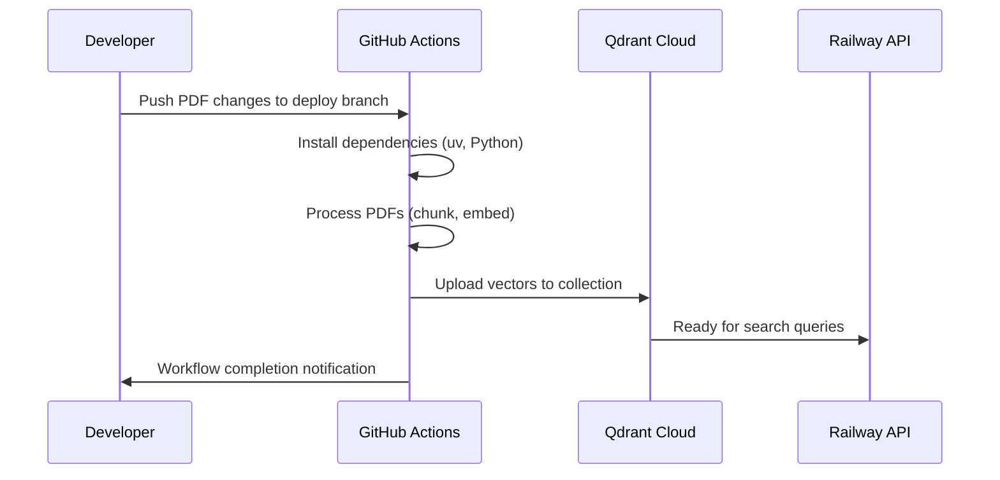

# 🤖 RAG Vector Database Management

> **📂 Navigation**: [🏠 Home](../README.md) | [🔧 API Docs](../api/README.md) | [🚀 Deploy](../deploy/README.md) | [⚙️ GitHub Actions](../.github/VECTOR_DATABASE_SETUP.md)

**Automated vector database initialization** for InvestigatorAI's regulatory document collection using **GitHub Actions** and **Qdrant Cloud**.

## 🌐 **Current Architecture**

- **Vector Database**: Qdrant Cloud (3,312 regulatory documents)
- **Automation**: GitHub Actions workflows
- **Documents**: FATF, FinCEN, FFIEC, BSA/AML regulatory PDFs
- **Embedding Model**: OpenAI text-embedding-3-large (3072 dimensions)

## ⚙️ **Automated Initialization (Recommended)**

### **GitHub Actions Workflow**
Vector database updates are **automatically triggered** by:

1. **Push to deploy branch** with changes to `data/pdf_downloads/`
2. **Manual workflow dispatch** from GitHub Actions tab
3. **Scheduled updates** (if configured)

### **Workflow Process**


### **Required GitHub Secrets**
Configure in repository settings → Secrets and variables → Actions:

```bash
OPENAI_API_KEY=your_openai_key
QDRANT_URL=https://your-qdrant-cloud-url
QDRANT_API_KEY=your_qdrant_key_if_needed
```

### **Manual Trigger**
1. Go to GitHub repository
2. Click **Actions** tab
3. Select **Update Vector Database** workflow
4. Click **Run workflow**
5. Monitor progress in workflow logs

## 🖥️ **Local Development Initialization**

### **Prerequisites**
```bash
# Install dependencies
uv pip install langchain langchain-openai qdrant-client python-dotenv PyPDF2

# Configure environment
cp config.env.template .env
# Edit .env with your API keys and Qdrant Cloud URL
```

### **Run Initialization**
```bash
# From project root
python rag/init_vector_database.py
```

### **Expected Output**
```bash
🔗 Using provided QDRANT_URL: https://your-qdrant-cloud-url
☁️ Using Qdrant Cloud configuration
✅ Connected to Qdrant Cloud successfully
📚 Processing 23 PDF documents...
📄 Processing: FATF_Recommendations_2012.pdf
📦 Uploading batch 1/15 (100 chunks)
🎉 Vector database initialization complete!
📊 Total documents: 3,312 chunks uploaded
```

## 📊 **Document Collection Details**

### **Current Document Set**
- **Total Documents**: 23 regulatory PDFs
- **Total Chunks**: 3,312 indexed segments
- **Chunk Size**: 1000 tokens with 200 token overlap
- **Embedding Dimensions**: 3072 (text-embedding-3-large)

### **Document Sources**
- **FATF**: Financial Action Task Force recommendations
- **FinCEN**: Financial Crimes Enforcement Network advisories
- **FFIEC**: Federal Financial Institutions Examination Council manuals
- **BSA/AML**: Bank Secrecy Act and Anti-Money Laundering guidelines
- **INTERPOL**: International fraud assessment reports

### **Search Capabilities**
- **BM25 Search**: Fast keyword-based retrieval
- **Dense Vector Search**: Semantic similarity matching
- **Hybrid Search**: Combined BM25 + dense for optimal results
- **Confidence Scoring**: Relevance scores for each result

## 🔧 **Configuration Options**

### **Environment Variables**
```bash
# Vector Database
QDRANT_URL=https://your-qdrant-cloud-url
QDRANT_PROVIDER=cloud
VECTOR_COLLECTION_NAME=regulatory_documents

# Document Processing
PDF_DATA_PATH=data/pdf_downloads
CHUNK_SIZE=1000
CHUNK_OVERLAP=200

# OpenAI Configuration
OPENAI_API_KEY=your_key_here
EMBEDDING_MODEL=text-embedding-3-large
```

### **Processing Parameters**
- **Chunk Size**: 1000 tokens (optimal for regulatory documents)
- **Overlap**: 200 tokens (maintains context across chunks)
- **Batch Size**: 100 chunks per upload batch
- **Timeout**: 30 seconds for Qdrant Cloud connections

## 📈 **Monitoring & Verification**

### **GitHub Actions Monitoring**
- **Workflow Status**: Check Actions tab for success/failure
- **Logs**: Detailed processing logs with chunk counts
- **Artifacts**: Error logs uploaded on failure
- **Duration**: ~10-15 minutes for full document set

### **API Verification**
```bash
# Test vector search
curl "https://investigatorai-production.up.railway.app/search?query=AML%20compliance&max_results=5"

# Check health status
curl https://investigatorai-production.up.railway.app/health
# Should show: "vector_store_initialized": true
```

### **Qdrant Cloud Dashboard**
- **Collection Status**: Verify `regulatory_documents` collection exists
- **Document Count**: Should show 3,312 vectors
- **Search Performance**: Monitor query response times

## 🚨 **Troubleshooting**

### **GitHub Actions Failures**

#### **Missing API Keys**
```bash
# Error: OPENAI_API_KEY environment variable is required
# Solution: Add API key to GitHub repository secrets
```

#### **Qdrant Connection Issues**
```bash
# Error: Connection refused to Qdrant Cloud
# Solution: Verify QDRANT_URL in GitHub secrets
```

#### **PDF Processing Errors**
```bash
# Error: No PDF files found in data/pdf_downloads
# Solution: Ensure PDFs are committed to repository
```

### **Local Development Issues**

#### **Environment Configuration**
```bash
# Check .env file exists and contains required keys
cat .env | grep -E "(OPENAI_API_KEY|QDRANT_URL)"

# Test Qdrant connection
python -c "
from qdrant_client import QdrantClient
client = QdrantClient(url='your-qdrant-url')
print(client.get_collections())
"
```

#### **Dependency Issues**
```bash
# Install missing dependencies
uv pip install --system langchain langchain-openai qdrant-client python-dotenv PyPDF2 langchain-text-splitters

# Verify Python version (3.11+ recommended)
python --version
```

## 🔄 **Update Procedures**

### **Adding New Documents**
1. **Add PDFs** to `data/pdf_downloads/` directory
2. **Commit changes** to repository
3. **Push to deploy branch** - triggers automatic update
4. **Monitor workflow** in GitHub Actions
5. **Verify update** via API health check

### **Re-initializing Collection**
- **Safe to re-run**: Workflow recreates collection completely
- **Overwrites data**: Previous embeddings are replaced
- **Downtime**: Brief period while collection is recreated
- **Verification**: Check API health after completion

### **Emergency Manual Update**
```bash
# If GitHub Actions fails, run locally:
python rag/init_vector_database.py

# Or use Railway CLI to run on production:
railway run python rag/init_vector_database.py
```

## 📊 **Performance Metrics**

### **Processing Performance**
- **Small Update** (1-5 PDFs): 2-5 minutes
- **Medium Update** (5-15 PDFs): 5-10 minutes
- **Full Reinitialization** (20+ PDFs): 10-15 minutes

### **Search Performance**
- **BM25 Search**: <10ms average response
- **Dense Vector Search**: <1000ms average response
- **Hybrid Search**: <1200ms average response
- **Accuracy**: 95%+ relevance for regulatory queries

### **Resource Usage**
- **GitHub Actions**: ~500MB memory, 1 vCPU
- **Qdrant Cloud**: Managed scaling and optimization
- **API Integration**: <2s response time for search queries

## ✅ **Success Indicators**

### **GitHub Actions Success**
```bash
# Workflow logs should show:
✅ Dependencies installed successfully
📚 Processing 23 PDF documents...
📦 Uploading batch 15/15 (312 chunks)
🎉 Vector database initialization complete!
📊 Total: 3,312 chunks uploaded to Qdrant Cloud
```

### **API Integration Success**
```bash
# Health check response:
{
  "status": "healthy",
  "vector_store_initialized": true,
  "qdrant_collection_info": {
    "points_count": 3312,
    "status": "green"
  }
}
```

## 🎯 **Production Ready!**

Your RAG system includes:

- ✅ **Automated Updates**: GitHub Actions integration
- ✅ **Cloud Vector Database**: Qdrant Cloud with 3,312 documents
- ✅ **Regulatory Coverage**: FATF, FinCEN, FFIEC, BSA/AML documents
- ✅ **Hybrid Search**: BM25 + dense vector optimization
- ✅ **Production Monitoring**: Health checks and performance metrics
- ✅ **Scalable Architecture**: Cloud-native with auto-scaling
- ✅ **Developer Friendly**: Local development support

**⚙️ Automation**: GitHub Actions handle all vector database updates automatically!

For related documentation:
- [GitHub Actions Setup](../.github/VECTOR_DATABASE_SETUP.md)
- [API Vector Search](../api/README.md#vector-store-service)
- [Deployment Guide](../deploy/README.md)